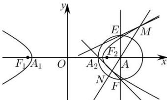

> [!faq]- 全练一本通解析
> **【答案】** （1） $\frac{x^2}{4} - y^2 = 1$ （2）证明见解析
>
> **【解析】**
> （1）设 $A(x_0,0), \Gamma$ 的半焦距为 $c(c > 0)$ ，则 $x_0 > c$ 因为 $\left|AA_1\right| = 5, \left|AA_2\right| = 1$ 所以 $\left\{ \begin{array}{l} x_0 + a = 5 \\ x_0 - a = 1 \end{array} \right.$ ，解得 $\left\{ \begin{array}{l} x_0 = 3 \\ a = 2 \end{array} \right.$ ，因为 $\left|AF_1\right| \cdot |AF_2| = 4$ ，所以 $(3 + c)(3 - c) = 4$ ，即 $9 - c^2 = 4$ ，解得 $c = \sqrt{5}$ ，则 $b = \sqrt{c^2 - a^2} = 1$ ，所以 $\Gamma$ 的方程为 $\frac{x^2}{4} - y^2 = 1$ 。（2）由（1）知，点 $A(3,0)$ ，设直线 $MN$ 的方程为 $x = ty + 3, t \neq 0$ 。由 $\left\{ \begin{array}{l} x = ty + 3 \\ \frac{x^2}{4} - y^2 = 1 \end{array} \right.$ ，可得 $\left(t^2 - 4\right)y^2 + 6ty + 5 = 0$ 则 $t^2 - 4 \neq 0, \Delta = (6t)^2 - 20(t^2 - 4) = 16t^2 + 80 > 0$ 设 $M(x_1,y_1), N(x_2,y_2)$ ，则 $y_1 + y_2 = -\frac{6t}{t^2 - 4}, y_1y_2 = \frac{5}{t^2 - 4}$ .
> 
> 由题可设 $E(3,m), F(3,-m)(m \neq 0)$ ，
> 则直线 $ME$ 的方程为 $y - m = \frac{y_1 - m}{x_1 - 3}(x - 3)$ ，
> 直线 $NF$ 的方程为 $y + m = \frac{y_2 + m}{x_2 - 3}(x - 3)$ ，
> 联立两方程，
> 可得 $2m = \left(\frac{y_2 + m}{x_2 - 3} - \frac{y_1 - m}{x_1 - 3}\right)(x - 3) = \left(\frac{y_2 + m}{ty_2} - \frac{y_1 - m}{ty_1}\right)(x - 3)$ $= \frac{m(y_1 + y_2)}{ty_1 y_2}(x - 3) = \frac{-\frac{6tm}{t^2 - 4}}{\frac{5t}{t^2 - 4}}(x - 3) = \frac{6}{5}m(3 - x)$ ，解得 $x = \frac{4}{3}$ ，即直线 $ME, NF$ 的交点恒在直线 $x = \frac{4}{3}$ 上。
