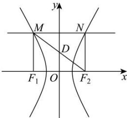
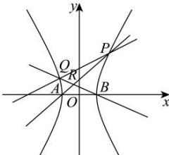

> [!faq]- 全练一本通解析
> **【答案】** （1） $x^2 + \left(y - \frac{3}{2}\right)^2 = \frac{25}{4}$ （2）证明见解析
>
> **【解析】**
> （1）由双曲线 $C: \frac{x^2}{a^2} - \frac{y^2}{b^2} = 1$ 的左、右焦点分别为 $F_1(-c,0), F_2(c,0)$ ，直线 $y = 3$ 与 $C$ 的左、右两支分别交于 $M, N$ 两点，且四边形 $MF_1F_2N$ 为矩形，
> 所以 $MF_1 \perp F_1F_2$ ，且 $|MF_1| = 3$ ，
> 由 $\left\{\begin{array}{l}\frac{x^2}{a^2} - \frac{y^2}{b^2} = 1 \\ x = -c\end{array}\right.$ ，解得 $\left\{\begin{array}{l}x = -c \\ y = -\frac{b^2}{a}\end{array}\right.$ 或 $\left\{\begin{array}{l}x = -c \\ y = \frac{b^2}{a}\end{array}\right.$ ，即 $M\left(-c, \frac{b^2}{a}\right)$ ，则 $\frac{b^2}{a} = 3$ ，又 $c^2 = a^2 + b^2, S_{MF_1F_2N} = 3 \times 2c = 12$ ，解得 $c = 2, a = 1, b = \sqrt{3}$ ，
> 所以双曲线 C 的方程为 $x^{2}-\frac{y^{2}}{3}=1$ ，
> 所以 $F_{1}(-2,0)$ , $F_{2}(2,0)$ , $M(-2,3)$ , $N(2,3)$ ,
> 
> 所以 $MF_{2}$ 的中点为 $D\left(0, \frac{3}{2}\right)$ ，又 $\left|MF_{2}\right| = \sqrt{4^{2} + 3^{2}} = 5$ ，
> 所以矩形 $MF_{1}F_{2}N$ 的外接圆的方程为 $x^{2}+\left(y-\frac{3}{2}\right)^{2}=\frac{25}{4}$ .
> （2）由（1）知 $A(-1,0)$ ， $B(1,0)$ ，
> 依题意知直线 l 的斜率不为零，设直线 l 为 $x=my-3, P(x_{1},y_{1}), Q(x_{2},y_{2})(y_{1},y_{2}\neq0)$ 由 $\left\{\begin{aligned}&x^{2}-\frac{y^{2}}{3}=1\\&x=my-3\end{aligned}\right.$ ，得 $(3m^{2}-1)y^{2}-18my+24=0$ .
> 当 $3m^{2}-1\neq0$ 且 $\Delta=324m^{2}-4\times24(3m^{2}-1)=36m^{2}+96>0$ 所以 $y_{1}+y_{2}=\frac{18m}{3m^{2}-1}$ ， $y_{1}y_{2}=\frac{24}{3m^{2}-1}$ 所以 $\frac{4}{3}(y_{1}+y_{2})=my_{1}y_{2}$ 直线 AP 的方程为 $y=\frac{y_{1}}{x_{1}+1}(x+1)$ ，直线 BQ 的方程为 $y=\frac{y_{2}}{x_{2}-1}(x-1)$ ，
> 联立两方程可得，所以 $\frac{y_{1}}{x_{1}+1}(x+1)=\frac{y_{2}}{x_{2}-1}(x-1)$ , $\frac{x+1}{x-1}=\frac{x_{1}+1}{y_{1}}\cdot\frac{y_{2}}{x_{2}-1}=\frac{(my_{1}-2)y_{2}}{y_{1}(my_{2}-4)}=\frac{my_{1}y_{2}-2y_{2}}{my_{1}y_{2}-4y_{1}}$ 所以 $\frac{x+1}{x-1}=\frac{\frac{4}{3}(y_{1}+y_{2})-2y_{2}}{\frac{4}{3}(y_{1}+y_{2})-4y_{1}}=\frac{\frac{4}{3}y_{1}-\frac{2}{3}y_{2}}{-\frac{8}{3}y_{1}+\frac{4}{3}y_{2}}=-\frac{1}{2}$ 解得 $x=-\frac{1}{3}$ ，故点 R 在定直线 $x=-\frac{1}{3}$ 上.
> 
