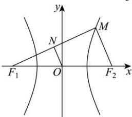
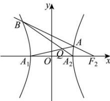

> [!faq]- 全练一本通解析
> **【答案】** （1） $x^{2}-\frac{y^{2}}{3}=1$ （2）证明见解析，直线方程为 $x=\frac{1}{2}$
>
> **【解析】**
> （1）由题意得 $A_{1}(-a,0),A_{2}(a,0),F_{1}(-c,0),F_{2}(c,0)$ ，因为 $\left|A_{1}F_{2}\right|=3\left|A_{2}F_{2}\right|$ ，所以 $c+a=3(c-a)$ ，解得c=2a，
> 因为 N 是线段 $MF_{1}$ 的中点，所以 $\left|MF_{2}\right|=2\left|NO\right|,\left|MF_{1}\right|=2\left|NF_{1}\right|$ ，
> 因为 $\left|NF_{1}\right|-\left|NO\right|=1$ ，所以 $\left|MF_{1}\right|-\left|MF_{2}\right|=2\left(\left|NF_{1}\right|-\left|NO\right|\right)=2$ 由双曲线定义得 2a=2，解得 a=1，故 $c=2, b=\sqrt{c^{2}-a^{2}}=\sqrt{3}$ ，故双曲线 E 的方程为 $x^{2}-\frac{y^{2}}{3}=1$ ；
> 
> （2）由（1）可得， $F_{2}(2,0)$ ， $A_{1}(-1,0)$ ， $A_{2}(1,0)$ ，过 $F_{2}$ 作直线 $l$ 交双曲线于 $A, B$ （ $A, B$ 与顶点不同），
> 故直线 $AB$ 的斜率不为0，设 $x = 2 + my$ ，联立 $x^{2} - \frac{y^{2}}{3} = 1$ 得， $\left(3m^{2} - 1\right)y^{2} + 12my + 9 = 0$ ，
> 设 $A(x_{1}, y_{1}), B(x_{2}, y_{2})$ ，则 $y_{1} + y_{2} = \frac{-12m}{3m^{2} - 1}, y_{1}y_{2} = \frac{9}{3m^{2} - 1}$ ，
> 直线 $AA_{1}: \frac{y}{y_{1}} = \frac{x + 1}{x_{1} + 1}$ ，直线 $BA_{2}: \frac{y}{y_{2}} = \frac{x - 1}{x_{2} - 1}$ ，
> 联立直线 $AA_{1}$ 与 $BA_{2}$ 得 $x = \frac{-y_{2}x_{1} - y_{1}x_{2} + y_{1} - y_{2}}{y_{1}x_{2} - y_{2}x_{1} - y_{1} - y_{2}}$ ，又 $x_{1} = 2 + my_{1}, x_{2} = 2 + my_{2}$ ，
> 故 $x = \frac{-y_{2}(2 + my_{1}) - y_{1}(2 + my_{2}) + y_{1} - y_{2}}{y_{1}(2 + my_{2}) - y_{2}(2 + my_{1}) - y_{1} - y_{2}} = \frac{-2my_{1}y_{2} - y_{1} - 3y_{2}}{y_{1} - 3y_{2}}$ $= \frac{-2my_{1}y_{2} - (y_{1} + y_{2}) - 2y_{2}}{(y_{1} + y_{2}) - 4y_{2}} = \frac{-2m \cdot \frac{9}{3m^{2} - 1} + \frac{12m}{3m^{2} - 1} - 2y_{2}}{\frac{-12m}{3m^{2} - 1} - 4y_{2}} = \frac{\frac{-6m}{3m^{2} - 1} - 2y_{2}}{\frac{-12m}{3m^{2} - 1} - 4y_{2}} = \frac{1}{2}$ 故点 $Q$ 在定直线 $x = \frac{1}{2}$ 上.
> 
