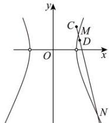

> [!faq]- 全练一本通解析
> **【解析】**
> （1） $x^{2}-\frac{y^{2}}{3}=1(x\neq\pm1)$ （2）证明见解析
> 解析：（1）设点 P 的坐标为 $(x,y)$ ，
> 由 $k_{PA} \cdot k_{PB} = 3$ 得 $\frac{y}{x+1} \cdot \frac{y}{x-1} = 3$ ，化简整理得 $x^{2}-\frac{y^{2}}{3}=1(x\neq\pm1)$ ，
> 所以曲线 $\Gamma$ 的方程为 $x^{2}-\frac{y^{2}}{3}=1(x\neq\pm1)$ .
> （2）若直线 l 的斜率不存在，则直线 l 与曲线 $\Gamma$ 只有一个交点，不符合题意，
> 所以直线 l 的斜率存在，设为 k，则直线 l 的方程为 $y-1=k(x-1)$ ，
> 设点 $M(x_{1},y_{1}), N(x_{2},y_{2}), D(x,y)$ 联立方程组 $\left\{\begin{aligned}y-1&=k(x-1),\\ x^{2}&-\frac{y^{2}}{3}=1,\end{aligned}\right.$ ，整理得 $\left(3-k^{2}\right)x^{2}+\left(2k^{2}-2k\right)x-\left(k^{2}-2k+4\right)=0$ ，易知 $k^{2}\neq3$ $\Delta=\left(2k^{2}-2k\right)^{2}+4\left(3-k^{2}\right)\left(k^{2}-2k+4\right)>0$ ，解得 k<2， $\left\{\begin{aligned}x_{1}+x_{2}&=\frac{2k^{2}-2k}{k^{2}-3}>0\\ x_{1}\cdot x_{2}&=\frac{k^{2}-2k+4}{k^{2}-3}>0\end{aligned}\right.$ ，解得 $k<-\sqrt{3}$ 或 $k>\sqrt{3}$ ，
> 综上 $k<-\sqrt{3}$ 或 $\sqrt{3}<k<2$ 因为 $\left|CM\right|=\sqrt{1+k^{2}}\left|x_{1}-1\right|=\sqrt{1+k^{2}}\left(x_{1}-1\right)$ 同理由 $|CM|\cdot|DN|=|MD|\cdot|CN|$ 得 $(x_{1}-1)(x_{2}-x)=(x_{2}-1)(x-x_{1})$ 化简整理得 $2x_{1}x_{2}-(x_{1}+x_{2})=(x_{1}+x_{2}-2)x$ 所以 $2\times\frac{k^{2}-2k+4}{k^{2}-3}-\frac{2k^{2}-2k}{k^{2}-3}=\left(\frac{2k^{2}-2k}{k^{2}-3}-2\right)x$ 化简整理得 $k=\frac{3x-4}{x-1}$ ，代入 $y-1=k(x-1)$ ，
> 化简整理得 3x-y-3=0，所以点 D 在定直线 3x-y-3=0 上.
> 
