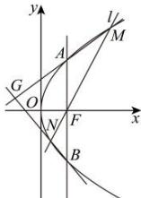

> [!faq]- 全练一本通解析
> **【答案】** （1） $y^{2}=4x$ ，焦点 $F(1,0)$ ；（2）证明见解析.
>
> **【解析】**
> （1）抛物线 $C:y^{2} = 2px$ 的焦点 $F(\frac{p}{2},0)$ ，则直线 $AB:x = \frac{p}{2}$ ，由 $\left\{ \begin{array}{l}x = \frac{p}{2}\\ y^2 = 2px \end{array} \right.$ 得 $|y| = p$ ，依题意， $|AB| = 2p = 4$ ，解得 $p = 2$ 所以抛物线 $C$ 的方程为 $y^{2} = 4x$ ，焦点 $F(1,0)$ （2）由抛物线对称性，不妨令点 $A$ 在 $x$ 上方，由（1）知， $A(1,2),B(1, - 2)$ 显然直线 $l$ 不垂直于坐标轴，设其方程为 $x = ty + 1(t\neq 0),M(x_1,y_1),N(x_2,y_2),y_2 <   0 <   y_1,$ 由 $\left\{ \begin{array}{l}x = ty + 1\\ y^2 = 4x \end{array} \right.$ 消去 $x$ 得： $y^{2} - 4ty - 4 = 0$ ，显然 $\Delta >0,y_{1} + y_{2} = 4t,y_{1}y_{2} = -4$ 直线 $AM$ 的斜率为 $k_{AM} = \frac{y_1 - 2}{x_1 - 1} = \frac{y_1 - 2}{\frac{y_1^2}{4} - 1} = \frac{4}{y_1 + 2},$ 方程为 $y = \frac{4}{y_1 + 2} (x - 1) + 2$ 直线BN的斜率为 $k_{BN} = \frac{y_2 + 2}{x_2 - 1} = \frac{y_2 + 2}{\frac{y_2^2}{4} - 1} = \frac{4}{y_2 - 2},$ 方程为 $y = \frac{4}{y_2 - 2} (x - 1) - 2,$ 由 $\left\{ \begin{array}{l}y = \frac{4}{y_1 + 2}(x - 1) + 2\\ y = \frac{4}{y_2 - 2}(x - 1) - 2 \end{array} \right.$ 消去 $y$ 得： $(\frac{4}{y_1 + 2} -\frac{4}{y_2 - 2})(x - 1) = -4,$ 整理得 $x = 1 - \frac{1}{\frac{1}{y_1 + 2} - \frac{1}{y_2 - 2}} = 1 - \frac{(y_1 + 2)(y_2 - 2)}{(y_2 - 2) - (y_1 + 2)} = 1 - \frac{y_1y_2 + 2y_2 - 2y_1 - 4}{y_2 - y_1 - 4}$ $= 1 - \frac{2y_2 - 2y_1 - 8}{y_2 - y_1 - 4} = -1$ 因此点 $G$ 的横坐标恒为，1.所以点 $G$ 在定直线 $x = -1$ 上
> 因此点 G 的横坐标恒为 -1，所以点 G 在定直线 x = -1 上.
> 
