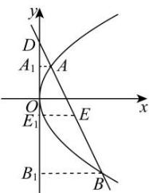

> [!faq]- 全练一本通解析
> **【答案】** （1） $y^{2}=12x$ （2）点E恒在直线y=3x上.
>
> **【解析】**
> （1）设 $A(x_{1},y_{1}),B(x_{2},y_{2})$ .
> 若直线 l 的倾斜角为 $135^{\circ}$ ，则直线 l 的方程为 $y=-x+2$ 。
> 联立 $\left\{\begin{aligned}y&=-x+2,\\ y^{2}&=2px,\end{aligned}\right.$ 得 $x^{2}-(4+2p)x+4=0$ 则 $\Delta=(4+2p)^{2}-16=4p^{2}+16p>0$ 且 $x_{1}+x_{2}=4+2p,x_{1}x_{2}=4$ 所以 $\left|AB\right|=\sqrt{2\left[\left(x_{1}+x_{2}\right)^{2}-4x_{1}x_{2}\right]}=2\sqrt{2}\sqrt{p^{2}+4p}$ 因为 $\left|AB\right|=4\sqrt{30}$ ，所以 p=6，故 C 的方程为 $y^{2}=12x$ 。
> （2）存在，定直线为 y=3x。
> 由题意知直线 AB 的斜率存在，
> 设直线 l 的方程为 $y=kx+2(k\neq0)$ ， $A(x_{1},y_{1}),B(x_{2},y_{2})$ 。
> 联立 $\left\{\begin{aligned}y^{2}&=12x,\\ y&=kx+2,\end{aligned}\right.$ 得 $k^{2}x^{2}+(4k-12)x+4=0$ 。
> 由 $k\neq0,\Delta=(4k-12)^{2}-16k^{2}>0$ ，得 $k<\frac{3}{2}$ 且 $k\neq0$ ， $x_{1}+x_{2}=\frac{12-4k}{k^{2}},x_{1}x_{2}=\frac{4}{k^{2}}$ 不妨设 $x_{1}<x_{2},E(x_{0},y_{0})$ ，则 $0<x_{1}<x_{0}<x_{2}$ ，
> 过点 A, E, B 向 y 轴作垂线，垂足分别为点 $A_{1}, E_{1}, B_{1}$ ，如图所示，
> 则 $\frac{\left|DA\right|}{\left|DB\right|}=\frac{\left|AA_{1}\right|}{\left|BB_{1}\right|}=\frac{x_{1}}{x_{2}}$ ， $\frac{\left|AE\right|}{\left|EB\right|}=\frac{x_{0}-x_{1}}{x_{2}-x_{0}}$
> 因为 $\frac{|DA|}{|DB|} = \frac{|AE|}{|EB|}$ ，所以 $\frac{x_{1}}{x_{2}} = \frac{x_{0} - x_{1}}{x_{2} - x_{0}}$ ，
> 整理得 $2x_{1}x_{2}=x_{0}(x_{1}+x_{2})$ ，所以 $x_{0}=\frac{2x_{1}x_{2}}{x_{1}+x_{2}}=\frac{2}{3-k}$ .
> 代入直线 l 的方程得 $y_{0}=k\cdot\frac{2}{3-k}+2=\frac{6}{3-k}$ .
> 因为 $y_{0}=3x_{0}$ ，所以点 E 恒在直线 y=3x 上.
> 
