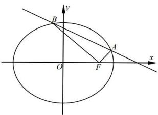

<!-- question-source:start -->
【5】设 F 为椭圆 $C: \frac{x^{2}}{2} + y^{2} = 1$ 的右焦点, 过点 $(2,0)$ 的直线与椭圆 C 交于 A, B 两点, 设直线 AF, BF 的斜率分别为 $k_{1}, k_{2} (k_{2} \neq 0)$ , 则 $\frac{k_{1}}{k_{2}}$ 为（）

A. 1 B.-1 C. 4 D.-4
<!-- question-source:end -->

![[Q00008623A1]]
