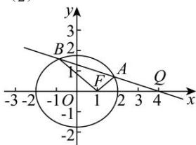

> [!faq]- 全练一本通解析
> **【解析】**
> （1） $3x - 2y - 4 = 0$ （2）证明见解析
> 解析：（1）设 $A(x_{1},y_{1})$ ， $B(x_{2},y_{2})$ ，则有 $\left\{ \begin{array}{l} x_{1} + x_{2} = 2 \\ y_{1} + y_{2} = -1 \end{array} \right.$ 且 $\left\{ \begin{array}{l}\frac{x_1^2}{4} + \frac{y_1^2}{3} = 1 \\ \frac{x_2^2}{4} + \frac{y_2^2}{3} = 1 \\ \frac{x_3^2}{4} + \frac{y_3^2}{3} = 1 \end{array} \right.$ ，作差可得 $\frac{(x_1 + x_2)(x_1 - x_2)}{4} + \frac{(y_1 + y_2)(y_1 - y_2)}{3} = 0$ ，
> 所以 $k_{AB} = \frac{y_1 - y_2}{x_1 - x_2} = -\frac{3}{4} \times \frac{x_1 + x_2}{y_1 + y_2} = \frac{3}{2}$ ，
> 由点斜式得， $y + \frac{1}{2} = \frac{3}{2}(x - 1)$ ，整理得 $3x - 2y - 4 = 0$ 即为直线 $l$ 的方程。
> 
> 不妨设 $AB$ 的直线方程为 $x = my + 4 (m \neq 0), A(x_3, y_3), B(x_4, y_4)$ ，联立 $\left\{ \begin{array}{l} x = my + 4 \\ \frac{x^2}{4} + \frac{y^2}{3} = 1 \end{array} \right.$ ，消去 $x$ 整理得 $(3m^2 + 4)y^2 + 24my + 36 = 0$ ，由韦达定理得， $y_3 + y_4 = \frac{-24m}{3m^2 + 4}, y_3y_4 = \frac{36}{3m^2 + 4}$ ，所以 $k_{FA} + k_{FB} = \frac{y_3}{x_3 - 1} + \frac{y_4}{x_4 - 1} = \frac{y_3(x_4 - 1) + y_4(x_3 - 1)}{(x_3 - 1)(x_4 - 1)} = \frac{y_3x_4 + y_4x_3 - (y_3 + y_4)}{(x_3 - 1)(x_4 - 1)}$ ，因为 $y_3x_4 + y_4x_3 - (y_3 + y_4) = y_3(my_4 + 4) + y_4(my_3 + 4) - (y_3 + y_4) = 2my_3y_4 + 3(y_3 + y_4) = 0$ ，所以 $k_{FA} + k_{FB} = 0$ 为定值.
