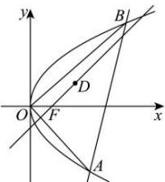

> [!faq]- 全练一本通解析
> **【答案】** （1） $y^2 = 4x$ （2）存在； $M(4,0)$
>
> **【解析】**
> （1）由题意过点 $D(2,1)$ 且斜率为1的直线方程为 $y - 1 = x - 2$ ，即 $y = x - 1$ ，令 $y = 0$ ，则 $x = 1$ ，
> ∴点 $F$ 的坐标为 $(1,0),\therefore \frac{p}{2} = 1$ ∴ $p = 2$ .抛物线 $C$ 的方程为 $y^{2} = 4x$ （2）由（1）得抛物线 $C:y^{2} = 4x$ ，假设存在定点 $M(m,0)$ 设直线 $AB$ 的方程为 $x = ty + m(t\in \mathbb{R},m\neq 0)$ ， $A(x_{1},y_{1}),B(x_{2},y_{2})$ 由 $\left\{ \begin{array}{l}x = ty + m\\ y^2 = 4x \end{array} \right.$ ，得 $y^{2} - 4ty - 4m = 0$ ， $\therefore y_{1} + y_{2} = 4t,y_{1}y_{2} = -4m,\Delta = 16t^{2} + 16m > 0,$ $\because OA\bot OB,\therefore \overline{OA}\cdot \overline{OB} = 0,$ $\therefore$ $\overline{OA}\cdot \overline{OB} = x_1x_2 + y_1y_2 = (ty_1 + m)(ty_2 + m) + y_1y_2 = (t^2 +1)y_1y_2 + tm(y_1 + y_2) + m^2$ $= -4m(t^2 +1) + 4mt^2 +m^2 = m^2 -4m = 0$ $\therefore m = 4$ 或 $m = 0$ （舍去），
> 当 $m = 4$ 时，点 $M$ 的坐标为 $(4,0)$ ，满足 $OA\bot OB,\Delta = 16t^{2} + 16m > 0,$ $\therefore$ 存在定点 $M(4,0)$
> 
