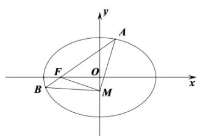

> [!faq]- 全练一本通解析
> **【答案】** （1） $\frac{x^{2}}{4}+y^{2}=1$ （2）为定值 $\frac{\pi}{2}$ ，理由见解析
>
> **【解析】**
> （1）由题意设椭圆方程为 $\frac{x^{2}}{a^{2}}+\frac{y^{2}}{b^{2}}=1(a>b>0)$ ，
> 将 $c=\sqrt{3}$ ， $a^{2}=b^{2}+c^{2}$ ，代入椭圆方程得 $\frac{x^{2}}{b^{2}+3}+\frac{y^{2}}{b^{2}}=1$ ，
> 又因为椭圆过点 $\left(1,-\frac{\sqrt{3}}{2}\right)$ ，得 $\frac{1}{b^{2}+3}+\frac{\frac{3}{4}}{b^{2}}=1$ ，
> 解得 $b^{2}=1$ ，所以 $a^{2}=4$ 。所以椭圆的方程为 $\frac{x^{2}}{4}+y^{2}=1$ ；
> （2）设直线 MN 的方程为 $x=ky-\frac{6}{5}$ ，
> 联立直线 MN 和椭圆的方程 $\left\{\begin{aligned}x&=ky-\frac{6}{5},\\ \frac{x^{2}}{4}&+y^{2}=1,\end{aligned}\right.$ 得 $(k^{2}+4)y^{2}-\frac{12}{5}ky-\frac{64}{25}=0$ 设 $M(x_{1},y_{1})$ ， $N(x_{2},y_{2})$ ， $A(-2,0)$ ， $y_{1}y_{2}=\frac{-64}{25(k^{2}+4)}$ ， $y_{1}+y_{2}=\frac{12k}{5(k^{2}+4)}$ ，
> 则 $\overline{AM}\cdot\overline{AN}=(x_{1}+2,y_{1})\cdot(x_{2}+2,y_{2})=(k^{2}+1)y_{1}y_{2}+\frac{4}{5}k(y_{1}+y_{2})+\frac{16}{25}=0.0\times(0.0)=0.0\times(0.0)=0.0\times(0.0)=0.0\times(0.0)=0.0\times(0.0)=0.0\times(0.0)=0.0\times(0.0)=0.0\times(0.0)=0.0\times(0.0)=0.0\times(0.0)=0.0\times(0.0)-0.0\times(0.0)=0.0\times(0.0)=0.0\times(0.0)=0.0\times(0.0)=0.0\times(0.0)=0.0\times(0.0)=0.0\times(0.0)=0.0\times(0.0)=0.0\times(0.0)=0.0\times(0.0)=-\frac{64}{5}.$
> 
