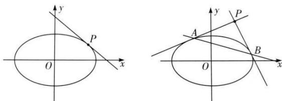

## 1. 椭圆的切线及切点弦

（1）椭圆 $\frac{x^2}{a^2} +\frac{y^2}{b^2} = 1(a > b > 0)$ 上一点 $P(x_0,y_0)$ 处的切线方程为 $\frac{x_0x}{a^2} +\frac{y_0y}{b^2} = 1.$ （2）椭圆 $\frac{x^2}{a^2} +\frac{y^2}{b^2} = 1(a > b > 0)$ 外一点 $P(x_0,y_0)$ 所引两条切线的切点弦方程是 $\frac{x_0x}{a^2} +\frac{y_0y}{b^2} = 1.$

第十二节 专题：圆锥曲线的核心二级结论及解题应用
