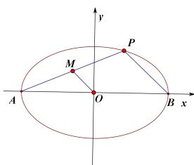
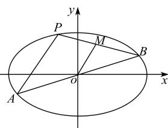

## 2. 与第三定义有关的常用结论

【推论1】若 $A, B$ 为椭圆或双曲线的顶点， $P$ 是椭圆或双曲线上异于 $A, B$ 的一点，若 $k_{PA}, k_{PB}$ 存在，则 $k_{PA} k_{PB} = e^2 - 1$ 。（椭圆为 $k_{PA} k_{PB} = -\frac{b^2}{a^2}$ ，双曲线为 $k_{PA} k_{PB} = \frac{b^2}{a^2}$ ）

第十二节 专题：圆锥曲线的核心二级结论及解题应用
【证明】（以椭圆 $\frac{x^{2}}{a^{2}}+\frac{y^{2}}{b^{2}}=1(a>b>0)$ 为例）

如图, 椭圆 \(\frac{x^2}{a^2} + \frac{y^2}{b^2} = 1\) 中, \(A(-a,0)\)、\(B(a,0)\) 是椭圆的左右顶点, \(P(x\_0, y\_0)\) 是椭圆上异于 \(A\)、\(B\) 的一点.

\(\because A(-a,0)\)、\(P(x\_0, y\_0)\) 在椭圆上, \(\therefore \begin{cases} \frac{a^2}{a^2} + \frac{0^2}{b^2} = 1 \\ \frac{x\_0^2}{a^2} + \frac{y\_0^2}{b^2} = 1 \end{cases}\),

两式相减得 \(\frac{(x\_0 + a)(x\_0 - a)}{a^2} = -\frac{y\_0^2}{b^2}\),

即 \(\frac{y\_0^2}{(x\_0 + a)(x\_0 - a)} = -\frac{b^2}{a^2} = e^2 - 1\),

取 \(AP\) 中点 \(M(\frac{x\_0 + a\_1}{2}, \frac{y\_0}{2})\), 连接 \(OM\), 则 \(OM // PB\),

\(\therefore k\_{PA} \cdot k\_{PB} = k\_{PA} \cdot k\_{OM} = \frac{y\_0}{x\_0 - a} \cdot \frac{y\_0}{x\_0 + a}\),

由此知, \(k\_{PA} \cdot k\_{PB} = k\_{PA} \cdot k\_{OM} = \frac{y\_0}{x\_0 - a} \cdot \frac{y\_0}{x\_0 + a} = e^2 - 1\).

【推论 2】若 \(A, B\) 为椭圆或双曲线上关于原点对称的两点, \(P\) 是椭圆或双曲线上异于 \(A\)、\(B\) 的一点, 若 \(k\_{PA}, k\_{PB}\) 存在, 则 \(k\_{PA} k\_{PB} = e^2 - 1\). （椭圆为 \(k\_{PA} k\_{PB} = -\frac{b^2}{a^2}\), 双曲线为 \(k\_{PA} k\_{PB} = \frac{b^2}{a^2}\）

【证明】（以椭圆 \(\frac{x^2}{a^2} + \frac{y^2}{b^2} = 1\) 为例）如图,

设 $A(x_{1},y_{1}),P(x_{0},y_{0})$ ，则 $B(-x_1, - y_1)$ 则 $\left\{ \begin{array}{l}\frac{x_0^2}{a^2} +\frac{y_0^2}{b^2} = 1\\ \frac{x_1^2}{a^2} +\frac{y_1^2}{b^2} = 1 \end{array} \right.$ 两式作差得到 $\frac{(x_0 + x_1)(x_0 - x_1)}{a^2} +\frac{(y_0 + y_1)(y_0 - y_1)}{b^2} = 0,$ $\therefore \frac{(y_0 + y_1)(y_0 - y_1)}{(x_0 + x_1)(x_0 - x_1)} = -\frac{b^2}{a^2} = \frac{c^2 - a^2}{a^2} = e^2 -1,$ 取 $AP$ 中点 $M\left(\frac{x_0 + x_1}{2},\frac{y_0 + y_1}{2}\right)$ ，连接 $OM$ ，则

$OM // PB, \therefore k_{PA} \cdot k_{PB} = k_{PA} \cdot k_{OM} = \frac{y_0 - y_1}{x_0 - x_1} \cdot \frac{y_0 + y_1}{x_0 + x_1}$ 由此知 $k_{PA} \cdot k_{PB} = k_{PA} \cdot k_{OM} = \frac{y_0 - y_1}{x_0 - x_1} \cdot \frac{y_0 + y_1}{x_0 + x_1} = e^2 - 1$ 【推论3】已知 $A, B$ 为椭圆或双曲线上任意两点， $M$ 是 $AB$ 的中点，则 $k_{AB} k_{OM} = e^2 - 1$ 。（点差法即可证明）

【推论 4】直线 AB 与椭圆相切于点 E，连接 OE，则 $k_{AB}k_{OE}=e^{2}-1$ （可通过推论 3，利用极限思想，当 A 无穷接近 B 点，可证明）

![[高中/课堂同步/题库/高中数学全练一本通/圆锥曲线/第十二节 专题_圆锥曲线的核心二级结论及解题应用/▶ ▷ 重点题型专练/2. 与第三定义有关的常用结论/questions/Q00008573.md]]
![[高中/课堂同步/题库/高中数学全练一本通/圆锥曲线/第十二节 专题_圆锥曲线的核心二级结论及解题应用/▶ ▷ 重点题型专练/2. 与第三定义有关的常用结论/questions/Q00008574.md]]
![[高中/课堂同步/题库/高中数学全练一本通/圆锥曲线/第十二节 专题_圆锥曲线的核心二级结论及解题应用/▶ ▷ 重点题型专练/2. 与第三定义有关的常用结论/questions/Q00008575.md]]
![[高中/课堂同步/题库/高中数学全练一本通/圆锥曲线/第十二节 专题_圆锥曲线的核心二级结论及解题应用/▶ ▷ 重点题型专练/2. 与第三定义有关的常用结论/questions/Q00008576.md]]
![[高中/课堂同步/题库/高中数学全练一本通/圆锥曲线/第十二节 专题_圆锥曲线的核心二级结论及解题应用/▶ ▷ 重点题型专练/2. 与第三定义有关的常用结论/questions/Q00008577.md]]
![[高中/课堂同步/题库/高中数学全练一本通/圆锥曲线/第十二节 专题_圆锥曲线的核心二级结论及解题应用/▶ ▷ 重点题型专练/2. 与第三定义有关的常用结论/questions/Q00008578.md]]
![[高中/课堂同步/题库/高中数学全练一本通/圆锥曲线/第十二节 专题_圆锥曲线的核心二级结论及解题应用/▶ ▷ 重点题型专练/2. 与第三定义有关的常用结论/questions/Q00008579.md]]
![[高中/课堂同步/题库/高中数学全练一本通/圆锥曲线/第十二节 专题_圆锥曲线的核心二级结论及解题应用/▶ ▷ 重点题型专练/2. 与第三定义有关的常用结论/questions/Q00008580.md]]
![[高中/课堂同步/题库/高中数学全练一本通/圆锥曲线/第十二节 专题_圆锥曲线的核心二级结论及解题应用/▶ ▷ 重点题型专练/2. 与第三定义有关的常用结论/questions/Q00008581.md]]
![[高中/课堂同步/题库/高中数学全练一本通/圆锥曲线/第十二节 专题_圆锥曲线的核心二级结论及解题应用/▶ ▷ 重点题型专练/2. 与第三定义有关的常用结论/questions/Q00008582.md]]
![[高中/课堂同步/题库/高中数学全练一本通/圆锥曲线/第十二节 专题_圆锥曲线的核心二级结论及解题应用/▶ ▷ 重点题型专练/2. 与第三定义有关的常用结论/questions/Q00008583.md]]
![[高中/课堂同步/题库/高中数学全练一本通/圆锥曲线/第十二节 专题_圆锥曲线的核心二级结论及解题应用/▶ ▷ 重点题型专练/2. 与第三定义有关的常用结论/questions/Q00008584.md]]
![[高中/课堂同步/题库/高中数学全练一本通/圆锥曲线/第十二节 专题_圆锥曲线的核心二级结论及解题应用/▶ ▷ 重点题型专练/2. 与第三定义有关的常用结论/questions/Q00008585.md]]
![[高中/课堂同步/题库/高中数学全练一本通/圆锥曲线/第十二节 专题_圆锥曲线的核心二级结论及解题应用/▶ ▷ 重点题型专练/2. 与第三定义有关的常用结论/questions/Q00008586.md]]
![[高中/课堂同步/题库/高中数学全练一本通/圆锥曲线/第十二节 专题_圆锥曲线的核心二级结论及解题应用/▶ ▷ 重点题型专练/2. 与第三定义有关的常用结论/questions/Q00008587.md]]
![[高中/课堂同步/题库/高中数学全练一本通/圆锥曲线/第十二节 专题_圆锥曲线的核心二级结论及解题应用/▶ ▷ 重点题型专练/2. 与第三定义有关的常用结论/questions/Q00008588.md]]
![[高中/课堂同步/题库/高中数学全练一本通/圆锥曲线/第十二节 专题_圆锥曲线的核心二级结论及解题应用/▶ ▷ 重点题型专练/2. 与第三定义有关的常用结论/questions/Q00008589.md]]
![[高中/课堂同步/题库/高中数学全练一本通/圆锥曲线/第十二节 专题_圆锥曲线的核心二级结论及解题应用/▶ ▷ 重点题型专练/2. 与第三定义有关的常用结论/questions/Q00008590.md]]
![[高中/课堂同步/题库/高中数学全练一本通/圆锥曲线/第十二节 专题_圆锥曲线的核心二级结论及解题应用/▶ ▷ 重点题型专练/2. 与第三定义有关的常用结论/questions/Q00008591.md]]
![[高中/课堂同步/题库/高中数学全练一本通/圆锥曲线/第十二节 专题_圆锥曲线的核心二级结论及解题应用/▶ ▷ 重点题型专练/2. 与第三定义有关的常用结论/questions/Q00008592.md]]
![[高中/课堂同步/题库/高中数学全练一本通/圆锥曲线/第十二节 专题_圆锥曲线的核心二级结论及解题应用/▶ ▷ 重点题型专练/2. 与第三定义有关的常用结论/questions/Q00008593.md]]
![[高中/课堂同步/题库/高中数学全练一本通/圆锥曲线/第十二节 专题_圆锥曲线的核心二级结论及解题应用/▶ ▷ 重点题型专练/2. 与第三定义有关的常用结论/questions/Q00008594.md]]

## 结论 6: 切线与切点弦方程
