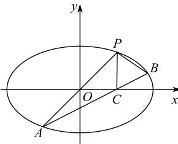

<!-- question-source:start -->
【54】如图, 已知椭圆 $\frac{x^{2}}{a^{2}} + \frac{y^{2}}{b^{2}} = 1 (a > b > 0)$ ，过原点的直线交椭圆于点 P，A 两点（其中点 P 在第一象限），过点 P 作 x 轴的垂线，垂点为 C，连 AC 并延长交椭圆于 B，若 $PA \perp PB$ ，则椭圆的离心率为 \_\_\_\_.

<!-- question-source:end -->

![[Q00008588A1]]
