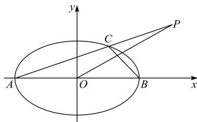

<!-- question-source:start -->
【55】如图, 已知椭圆 $\frac{x^{2}}{a^{2}} + \frac{y^{2}}{b^{2}} = 1 (a > b > 0)$ 的左右顶点为 A, B, P 为第一象限内一点, 且 $PB \perp AB$ , 连接 PA 交椭圆于点 C, 连 BC, OP, 若 $OP \perp BC$ , 则椭圆的离心率为 \_\_\_\_.

<!-- question-source:end -->
