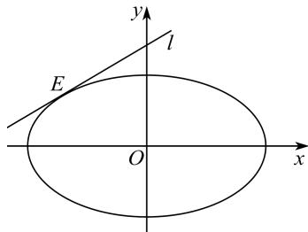

<!-- question-source:start -->
【60】已知椭圆 $M: \frac{x^{2}}{a^{2}} + \frac{y^{2}}{b^{2}} = 1 (a > b > 0)$ 的离心率为 $\frac{1}{2}$ ，直线 $l: x - 2y + 4\sqrt{2} = 0$ 与 M 相切于点 E，则椭圆 M 的方程为 \_\_\_\_.

<!-- question-source:end -->
