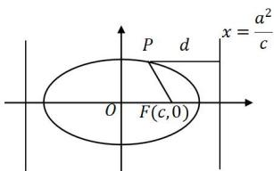
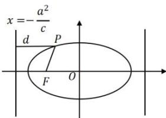

## 2. 椭圆的第二定义

椭圆的第二定义:平面上到定 F 的距离与到定直线 l 的距离之比是常数 $e \in (0,1)$ 的点的轨迹叫做椭圆（如下图），即 $\frac{|PF|}{d} = e$ 。定点 F 叫焦点，定直线 l 叫准线。焦点分为左焦点和右焦点，准线分为左准线 $x = -\frac{a^{2}}{c}$ 和右准线 $x = \frac{a^{2}}{c}$ 。注意：左焦点对应左准线，右焦点对应右准线。

