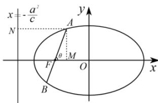
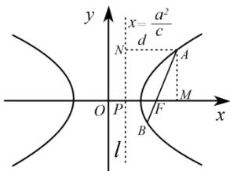

## 3. 双曲线的第二定义

平面内到定点 F 的距离与到定直线 l （定点 F 在定直线 l 外）的距离之比为常数 e （其中 e > 1 ）的点的轨迹是双曲线. 常数 e 是双曲线的离心率. 定点 F 是双曲线的焦点, 定直线 l 是双曲线相应于定点 F 的准线.

（1）对于双曲线 $\frac{x^2}{a^2} -\frac{y^2}{b^2} = 1(a > 0,b > 0)$ ，左焦点 $F_{1}(-c,0)$ 对应的准线方程为 $x = -\frac{a^2}{c}$ ；右焦点 $F_{2}(c,0)$ 对应的准线方程为 $x = \frac{a^2}{c}$

（2）对于双曲线 $\frac{y^2}{a^2} -\frac{x^2}{b^2} = 1(a > 0,b > 0)$ ，下焦点 $F_{1}(0, - c)$ 对应的准线方程为 $y = -\frac{a^2}{c}$ ；上焦点 $F_{2}(0,c)$ 对应的准线方程为 $y = \frac{a^2}{c}$

![[高中/课堂同步/题库/高中数学全练一本通/圆锥曲线/第十二节 专题:圆锥曲线的核心二级结论及解题应用/▶ ▷ 重点题型专练/3. 双曲线的第二定义/questions/Q00008535.md]]
![[高中/课堂同步/题库/高中数学全练一本通/圆锥曲线/第十二节 专题:圆锥曲线的核心二级结论及解题应用/▶ ▷ 重点题型专练/3. 双曲线的第二定义/questions/Q00008536.md]]
![[高中/课堂同步/题库/高中数学全练一本通/圆锥曲线/第十二节 专题:圆锥曲线的核心二级结论及解题应用/▶ ▷ 重点题型专练/3. 双曲线的第二定义/questions/Q00008537.md]]
![[高中/课堂同步/题库/高中数学全练一本通/圆锥曲线/第十二节 专题:圆锥曲线的核心二级结论及解题应用/▶ ▷ 重点题型专练/3. 双曲线的第二定义/questions/Q00008538.md]]
![[高中/课堂同步/题库/高中数学全练一本通/圆锥曲线/第十二节 专题:圆锥曲线的核心二级结论及解题应用/▶ ▷ 重点题型专练/3. 双曲线的第二定义/questions/Q00008539.md]]
![[高中/课堂同步/题库/高中数学全练一本通/圆锥曲线/第十二节 专题:圆锥曲线的核心二级结论及解题应用/▶ ▷ 重点题型专练/3. 双曲线的第二定义/questions/Q00008540.md]]
![[高中/课堂同步/题库/高中数学全练一本通/圆锥曲线/第十二节 专题:圆锥曲线的核心二级结论及解题应用/▶ ▷ 重点题型专练/3. 双曲线的第二定义/questions/Q00008541.md]]
![[高中/课堂同步/题库/高中数学全练一本通/圆锥曲线/第十二节 专题:圆锥曲线的核心二级结论及解题应用/▶ ▷ 重点题型专练/3. 双曲线的第二定义/questions/Q00008542.md]]
## 结论 2:与坐标有关的焦半径公式

1. 椭圆的焦半径公式（坐标式）
（1） $\left|PF_{1}\right|=a+ex_{0},\left|PF_{2}\right|=a-ex_{0}$ ， $x_{0}$ 为 P 点横坐标（焦点在 x 轴）
（2） $\left|PF_{1}\right|=a+ey_{0},\left|PF_{2}\right|=a-ey_{0}$ ， $y_{0}$ 为 P 点纵坐标（焦点在 y 轴）
【证明】(第一定义)对于椭圆方程: $\frac{x^{2}}{a^{2}}+\frac{y^{2}}{b^{2}}=1$ ，由椭圆上任意点 $P(x,y)$ 及左右焦点 $F_{1}(-c,0)$ 、 $F_{2}(c,0)$ ，得 $\left|PF_{1}\right|=\sqrt{(x+c)^{2}+y^{2}}=\sqrt{(x+c)^{2}+b^{2}\left(1-\frac{x^{2}}{a^{2}}\right)}$ $=\sqrt{\frac{a^{2}-b^{2}}{a^{2}}x^{2}+2cx+\left(c^{2}+b^{2}\right)}$ $=\sqrt{\frac{c^{2}}{a^{2}}x^{2}+2cx+a^{2}}=\left|a+\frac{c}{a}x\right|;$ 同理， $\left|PF_{2}\right|=\sqrt{(x-c)^{2}+y^{2}}=\left|a-\frac{c}{a}x\right|;$ 根据椭圆方程知， $\frac{c}{a}\in(0,1),|x|\leq a\Rightarrow a>\frac{c}{a}|x|$ ，即第十二节 专题：圆锥曲线的核心二级结论及解题应用 $a \pm \frac{c}{a} x > 0$ 故椭圆 $\frac{x^{2}}{a^{2}} + \frac{y^{2}}{b^{2}} = 1$ 两个焦半径为 $\left|PF_{1}\right|=a+\frac{c}{a}x,\left|PF_{2}\right|=a-\frac{c}{a}x,$ 根据圆锥曲线的第二定义可快速简单进行证明, 结合图像, 长的为加, 短的为减.

2. 双曲线的焦半径公式（坐标式） $F_{1}, F_{2}$ 为双曲线的两个焦点， $P(x_{0}, y_{0})$ 为双曲线上任意一点，则
（1） $\left|PF_{1}\right|=\left|a+ex_{0}\right|,\left|PF_{2}\right|=\left|a-ex_{0}\right|$ . （焦点在 x 轴）
（2） $\left|PF_{1}\right|=\left|a+ey_{0}\right|,\left|PF_{2}\right|=\left|a-ey_{0}\right|$ . （焦点在 y 轴）
【证明】设 $P(x_{0},y_{0})$ , $\left|PF_{1}\right|^{2}=\left(x_{0}+c\right)^{2}+y_{0}^{2}=\left(x_{0}+c\right)^{2}+\frac{b^{2}}{a^{2}}x_{0}^{2}-b^{2}=$ $\frac{a^{2}+b^{2}}{a^{2}}x_{0}^{2}+2cx_{0}+c^{2}-b^{2}=\frac{c^{2}}{a^{2}}x_{0}^{2}+2cx_{0}+a^{2}$ $=e^{2}x_{0}^{2}+2eax_{0}+a^{2}=\left(a+ex_{0}\right)^{2}$ 因为 $x_{0} \leq -a$ 或 $a \geq x_{0}$ ，所以无法判断正负，所以 $\left|PF_{1}\right|=\left|a+ex_{0}\right|$ ，因为 $\left\|PF_{2}\right|-\left|PF_{1}\right|=2a$ ，所以 $\left|PF_{2}\right|=\left|a-ex_{0}\right|$

![[高中/课堂同步/题库/高中数学全练一本通/圆锥曲线/第十二节 专题:圆锥曲线的核心二级结论及解题应用/▶ ▷ 重点题型专练/3. 双曲线的第二定义/questions/Q00008543.md]]
![[高中/课堂同步/题库/高中数学全练一本通/圆锥曲线/第十二节 专题:圆锥曲线的核心二级结论及解题应用/▶ ▷ 重点题型专练/3. 双曲线的第二定义/questions/Q00008544.md]]
![[高中/课堂同步/题库/高中数学全练一本通/圆锥曲线/第十二节 专题:圆锥曲线的核心二级结论及解题应用/▶ ▷ 重点题型专练/3. 双曲线的第二定义/questions/Q00008545.md]]
![[高中/课堂同步/题库/高中数学全练一本通/圆锥曲线/第十二节 专题:圆锥曲线的核心二级结论及解题应用/▶ ▷ 重点题型专练/3. 双曲线的第二定义/questions/Q00008546.md]]
![[高中/课堂同步/题库/高中数学全练一本通/圆锥曲线/第十二节 专题:圆锥曲线的核心二级结论及解题应用/▶ ▷ 重点题型专练/3. 双曲线的第二定义/questions/Q00008547.md]]
![[高中/课堂同步/题库/高中数学全练一本通/圆锥曲线/第十二节 专题:圆锥曲线的核心二级结论及解题应用/▶ ▷ 重点题型专练/3. 双曲线的第二定义/questions/Q00008548.md]]
![[高中/课堂同步/题库/高中数学全练一本通/圆锥曲线/第十二节 专题:圆锥曲线的核心二级结论及解题应用/▶ ▷ 重点题型专练/3. 双曲线的第二定义/questions/Q00008549.md]]
![[高中/课堂同步/题库/高中数学全练一本通/圆锥曲线/第十二节 专题:圆锥曲线的核心二级结论及解题应用/▶ ▷ 重点题型专练/3. 双曲线的第二定义/questions/Q00008550.md]]
![[高中/课堂同步/题库/高中数学全练一本通/圆锥曲线/第十二节 专题:圆锥曲线的核心二级结论及解题应用/▶ ▷ 重点题型专练/3. 双曲线的第二定义/questions/Q00008551.md]]
![[高中/课堂同步/题库/高中数学全练一本通/圆锥曲线/第十二节 专题:圆锥曲线的核心二级结论及解题应用/▶ ▷ 重点题型专练/3. 双曲线的第二定义/questions/Q00008552.md]]
![[高中/课堂同步/题库/高中数学全练一本通/圆锥曲线/第十二节 专题:圆锥曲线的核心二级结论及解题应用/▶ ▷ 重点题型专练/3. 双曲线的第二定义/questions/Q00008553.md]]
## 结论 3:与倾斜角有关的焦半径公式

1. 椭圆的焦半径公式
如图, F 是椭圆 $\frac{x^{2}}{a^{2}} + \frac{y^{2}}{b^{2}} = 1$ 的左焦点, AB 是过焦点的弦且倾斜角为 $\theta$ , 点 A 在 x 轴上方, 则 $\left|AF\right|=\frac{b^{2}}{a-c\cos\theta},\left|BF\right|=\frac{b^{2}}{a+c\cos\theta}.$ 当 F 是椭圆 $\frac{x^{2}}{a^{2}}+\frac{y^{2}}{b^{2}}=1$ 的右焦时, $\left|AF\right|=\frac{b^{2}}{a+c\cos\theta},\left|BF\right|=\frac{b^{2}}{a-c\cos\theta}.$ 焦点弦长: $\left|AB\right|=\frac{2ab^{2}}{a^{2}-c^{2}\cos^{2}\theta}$ 注意: 正负也可通过弦的长短决定, $\left|AF\right|=\frac{b^{2}}{a\pm c\cos\theta},\left|BF\right|=\frac{b^{2}}{a\mp c\cos\theta}$ 无需分左右焦点.

【证明】以左焦点为例, 设左准线 l 交 x 轴于点 P, 过点 A 作 $AM \perp x$ 轴于 M, 作 $AN \perp l$ 于 N, 设 d 为点 A 到准线 l 的距离, 其中 $\left|PF\right|=\frac{a^{2}}{c}-c,\left|MF\right|=\left|AF\right|\cdot\left|\cos\theta\right|$ ,
则 $d=|AN|=|PF|+|FM|=\frac{a^{2}}{c}-c+|AF|\cdot\cos\theta$ 由 $e=\frac{|AF|}{d}$ 得 $\left|AF\right|=\left(\frac{a^{2}}{c}-c+\left|AF\right|\cos\theta\right)\cdot e=\frac{b^{2}}{a}+e\left|AF\right|\cos\theta,$ 因此 $\left|AF\right|=\frac{\frac{b^{2}}{a}}{1-e\cos\theta}=\frac{b^{2}}{a-c\cos\theta}$ 同理 $\left|BF\right|=\frac{b^{2}}{a+c\cos\theta}$ .

2. 双曲线的焦半径公式
如图, F 是双曲线 $\frac{x^{2}}{a^{2}} - \frac{y^{2}}{b^{2}} = 1$ 的右焦点, 过焦点的弦倾斜角为 $\theta$ , 交双曲线同一支于 A, B 两点, 点 A 在 x 轴上方, 则 $\left|AF\right|=\frac{b^{2}}{a-c\cos\theta},\left|BF\right|=\frac{b^{2}}{a+c\cos\theta}$ 当 F 是双曲线的左焦点时, 则 $\left|AF\right|=\frac{b^{2}}{a+c\cos\theta},\left|BF\right|=\frac{b^{2}}{a-c\cos\theta}$ 焦点弦长: $\left|AB\right|=\frac{2ab^{2}}{a^{2}-c^{2}\cos^{2}\theta}$ 注意:①正负也可由弦的长短决定 $\left|AF\right|=\frac{b^{2}}{a\pm c\cos\theta},\left|BF\right|=\frac{b^{2}}{a\mp c\cos\theta}$ ，不必区分左右焦点.
②当直线与双曲线交于双支时, 带入公式可得焦半径为负数, 故为了统一焦半径公式, 最后结果都取正数.

【证明】以右焦点为例, 设右准线 l 交 x 轴于点 P, 过点 A 作 $AM \perp x$ 轴于 M, 作 $AN \perp l$ 于 N, 设 d 为点 A 到准线 l 的距离, 其中 $|PF| = c - \frac{a^{2}}{c}, |MF| = |AF| \cdot |\cos \theta|$ ,

则 $d = |AN| = |PF| + |FM| = c - \frac{a^{2}}{c} + |AF| \cdot \cos \theta$ .

由双曲线第二定义 $e = \frac{|AF|}{d}$ 得 $|AF| = \left(c - \frac{a^{2}}{c} + |AF| \cos \theta\right) \cdot e = \frac{b^{2}}{a} + e |AF| \cos \theta$ ,

因此 $\left|AF\right| = \frac{\frac{b^{2}}{a}}{1 - e \cos \theta} = \frac{b^{2}}{a - c \cos \theta}$ .

同理 $|BF| = \frac{b^{2}}{a + c \cos \theta}$ .

第十二节 专题: 圆锥曲线的核心二级结论及解题应用
![[高中/课堂同步/题库/高中数学全练一本通/圆锥曲线/第十二节 专题:圆锥曲线的核心二级结论及解题应用/▶ ▷ 重点题型专练/3. 双曲线的第二定义/questions/Q00008554.md]]
![[高中/课堂同步/题库/高中数学全练一本通/圆锥曲线/第十二节 专题:圆锥曲线的核心二级结论及解题应用/▶ ▷ 重点题型专练/3. 双曲线的第二定义/questions/Q00008555.md]]
![[高中/课堂同步/题库/高中数学全练一本通/圆锥曲线/第十二节 专题:圆锥曲线的核心二级结论及解题应用/▶ ▷ 重点题型专练/3. 双曲线的第二定义/questions/Q00008556.md]]
![[高中/课堂同步/题库/高中数学全练一本通/圆锥曲线/第十二节 专题:圆锥曲线的核心二级结论及解题应用/▶ ▷ 重点题型专练/3. 双曲线的第二定义/questions/Q00008557.md]]
![[高中/课堂同步/题库/高中数学全练一本通/圆锥曲线/第十二节 专题:圆锥曲线的核心二级结论及解题应用/▶ ▷ 重点题型专练/3. 双曲线的第二定义/questions/Q00008558.md]]
![[高中/课堂同步/题库/高中数学全练一本通/圆锥曲线/第十二节 专题:圆锥曲线的核心二级结论及解题应用/▶ ▷ 重点题型专练/3. 双曲线的第二定义/questions/Q00008559.md]]
![[高中/课堂同步/题库/高中数学全练一本通/圆锥曲线/第十二节 专题:圆锥曲线的核心二级结论及解题应用/▶ ▷ 重点题型专练/3. 双曲线的第二定义/questions/Q00008560.md]]
![[高中/课堂同步/题库/高中数学全练一本通/圆锥曲线/第十二节 专题:圆锥曲线的核心二级结论及解题应用/▶ ▷ 重点题型专练/3. 双曲线的第二定义/questions/Q00008561.md]]
![[高中/课堂同步/题库/高中数学全练一本通/圆锥曲线/第十二节 专题:圆锥曲线的核心二级结论及解题应用/▶ ▷ 重点题型专练/3. 双曲线的第二定义/questions/Q00008562.md]]
## 结论 4: 焦半径比例公式

设圆锥曲线 C 的焦点 F 在 x 轴上, 过点 F 且斜率为 k 的直线 l 交曲线 C 于 A, B 两点, 若 $\overrightarrow{AF} = \lambda \overrightarrow{FB} (\lambda > 0)$ , 则 $e = \sqrt{1 + k^{2}} \left| \frac{\lambda - 1}{\lambda + 1} \right|$ , 即 $|e \cos \theta| = \left| \frac{\lambda - 1}{\lambda + 1} \right|$ .

（椭圆, 双曲线, 抛物线均适用, 抛物线 e = 1）

若焦点在 y 轴, 则 $|e \sin \theta| = \left| \frac{\lambda - 1}{\lambda + 1} \right|$ 【证明】过椭圆 $\frac{x^{2}}{a^{2}} + \frac{y^{2}}{b^{2}} = 1$ 的左焦点, AB 是过焦点的弦且倾斜角为 $\theta$ , 点 A 在 x 轴上方, 根据焦半径公式, 则 $|AF| = \frac{b^{2}}{a - c \cos \theta}$ , $|BF| = \frac{b^{2}}{a + c \cos \theta}$ ,

令 $\overrightarrow{AF} = \lambda \overrightarrow{FB} (\lambda > 0)$ , 则 $\frac{b^{2}}{a - c \cos \theta} = \frac{\lambda b^{2}}{a + c \cos \theta}$ ,

整理化简得 $\frac{c}{a} \cos \theta = \frac{\lambda - 1}{\lambda + 1}$ , 及 $e \cos \theta = \frac{\lambda - 1}{\lambda + 1}$ . 对于不同的焦点及倾斜角, 公式的正负会发生变化, 为统一公式形式, 可得 $|e \cos \theta| = \left| \frac{\lambda - 1}{\lambda + 1} \right|$ .

第十二节 专题: 圆锥曲线的核心二级结论及解题应用

![[高中/课堂同步/题库/高中数学全练一本通/圆锥曲线/第十二节 专题:圆锥曲线的核心二级结论及解题应用/▶ ▷ 重点题型专练/3. 双曲线的第二定义/questions/Q00008563.md]]
![[高中/课堂同步/题库/高中数学全练一本通/圆锥曲线/第十二节 专题:圆锥曲线的核心二级结论及解题应用/▶ ▷ 重点题型专练/3. 双曲线的第二定义/questions/Q00008564.md]]
![[高中/课堂同步/题库/高中数学全练一本通/圆锥曲线/第十二节 专题:圆锥曲线的核心二级结论及解题应用/▶ ▷ 重点题型专练/3. 双曲线的第二定义/questions/Q00008565.md]]
![[高中/课堂同步/题库/高中数学全练一本通/圆锥曲线/第十二节 专题:圆锥曲线的核心二级结论及解题应用/▶ ▷ 重点题型专练/3. 双曲线的第二定义/questions/Q00008566.md]]
![[高中/课堂同步/题库/高中数学全练一本通/圆锥曲线/第十二节 专题:圆锥曲线的核心二级结论及解题应用/▶ ▷ 重点题型专练/3. 双曲线的第二定义/questions/Q00008567.md]]
![[高中/课堂同步/题库/高中数学全练一本通/圆锥曲线/第十二节 专题:圆锥曲线的核心二级结论及解题应用/▶ ▷ 重点题型专练/3. 双曲线的第二定义/questions/Q00008568.md]]
![[高中/课堂同步/题库/高中数学全练一本通/圆锥曲线/第十二节 专题:圆锥曲线的核心二级结论及解题应用/▶ ▷ 重点题型专练/3. 双曲线的第二定义/questions/Q00008569.md]]
![[高中/课堂同步/题库/高中数学全练一本通/圆锥曲线/第十二节 专题:圆锥曲线的核心二级结论及解题应用/▶ ▷ 重点题型专练/3. 双曲线的第二定义/questions/Q00008570.md]]
![[高中/课堂同步/题库/高中数学全练一本通/圆锥曲线/第十二节 专题:圆锥曲线的核心二级结论及解题应用/▶ ▷ 重点题型专练/3. 双曲线的第二定义/questions/Q00008571.md]]
![[高中/课堂同步/题库/高中数学全练一本通/圆锥曲线/第十二节 专题:圆锥曲线的核心二级结论及解题应用/▶ ▷ 重点题型专练/3. 双曲线的第二定义/questions/Q00008572.md]]
## 结论 5: 圆锥曲线第三定义及其推论
