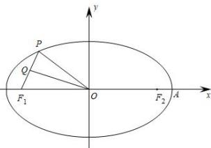

<!-- question-source:start -->
【4】如图， $P$ 是椭圆 $\frac{x^2}{25} +\frac{y^2}{9} = 1$ 上的一点， $F_{1}$ 是椭圆的左焦点， $Q$ 是线段 $PF_{1}$ 的中点， $\left|OQ\right| = 4$ ，则点 $P$ 到该椭圆左准线的距离为（）

A. $\frac{15}{4}$ B. 2 C. $\frac{5}{2}$ D. 8
<!-- question-source:end -->

![[Q00008538A1]]
