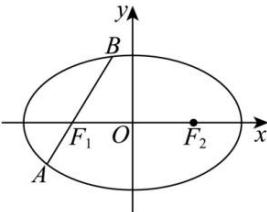

<!-- question-source:start -->
【28】（2024·全国高三专题）如图所示，过椭圆 $\frac{x^{2}}{4}+\frac{y^{2}}{3}=1$ 的左焦点 $F_{1}$ 任作一直线交椭圆于A,B两点.若 $\left|AF_{1}\right|+\left|F_{1}B\right|=\lambda\left|AF_{1}\right|\cdot\left|F_{1}B\right|$ ，则 $\lambda$ 的值为\_\_\_\_.

<!-- question-source:end -->

![[Q00008562A1]]
