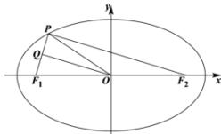

> [!faq]- 全练一本通解析
> **【答案】** C
>
> **【解析】**
> 解析:如下图所示,连接 $PF_{2}$
> 
> 在椭圆 $\frac{x^{2}}{25}+\frac{y^{2}}{9}=1$ 中，a=5, b=3, c=4.
> 因为 O 为 $F_{1}F_{2}$ 的中点，Q 为 $PF_{1}$ 的中点，所以， $\left|PF_{2}\right|=2\left|OQ\right|=8$ ，
> 由椭圆的定义可得 $\left|PF_{1}\right|=2a-\left|PF_{2}\right|=2$ ，设点 P 到该椭圆左准线的距离为 d，由椭圆的第二定义可得， $\frac{\left|PF_{1}\right|}{d}=\frac{c}{a}=\frac{4}{5}$ ，因此， $d=2\times\frac{5}{4}=\frac{5}{2}$ .
>
> 故选 **C**.
