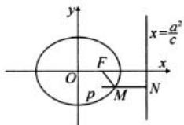

> [!faq]- 全练一本通解析
> **【解析】**
> 4
> 解析:如图， $F(1,0)$ ，椭圆的离心率为 $\frac{c}{a}=\frac{\sqrt{5}}{5}$ ，由椭圆的第二定义可知 $\sqrt{5}|MF|=|MN|$ ∴ $\left|MP\right| + \sqrt{5}\left|MF\right|$ 的最小值，就是由 P 作 PN 垂直于椭圆的准线于 N， $\left|PN\right|$ 为所求，椭圆的右准线方程为 $x=\frac{a^{2}}{c}=5$ ，∴ $MP+\sqrt{5}MF$ 的最小值为：5-1=4.
> 
