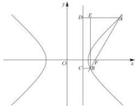

> [!faq]- 全练一本通解析
> **【答案】** A
>
> **【解析】**
> 解析:设 $\left|BF\right|=x$ ，则 $\left|AF\right|=5x$ ，
> 过 A、B 作双曲线右准线 $x=\frac{a^{2}}{c}$ 的垂线, 垂足分别为 D、C, 过 B 作 AD 的垂线, 垂足为 E.
> 
> 根据双曲线的第二定义可得 $\left|AD\right|=\frac{5x}{e}$ ， $\left|BC\right|=\frac{x}{e}$ ，$\therefore \left|AE\right| = \frac{4x}{e}$ 由直线的斜率为 $\sqrt{3}$ ，可得在 Rt△ABE 中，∠ABE = 30°， $\therefore \left|AB\right| = 2\left|AE\right|$ ， $\therefore \left|AB\right| = \left|AF\right| + \left|BF\right| = 6x = 2\left|AE\right| = 2 \times \frac{4x}{e}$ ， $\therefore e = \frac{4}{3}$ .
>
> 故选 **A**.
