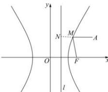

> [!faq]- 全练一本通解析
> **【答案】** 详见解析
>
> **【解析】**
> $\frac{36}{5}$
> 
> 由题意得 $a = 3, b = 4$ ，则 $c = \sqrt{a^2 + b^2} = \sqrt{3^2 + 4^2} = 5$ ，
> 所以 $e = \frac{c}{a} = \frac{5}{3}$ ，
> 过点 $M$ 作 $MN$ 垂直于双曲线的右准线 $x = \frac{a^2}{c}$ ，垂足为 $N$ ，
> 设 $\left|MN = d\right|$ ，则 $\frac{\left|MF_2\right|}{d} = e$ ，即 $\left|MF_2\right| = \frac{5}{3} d$ ，
> 所以 $\left|MA\right| + \frac{3}{5}\left|MF_2\right| = \left|MA\right| + d$ 。
> 显然，当 $M, N, A$ 三点共线时， $\left|MA\right| + \frac{3}{5}\left|MF_2\right|$ 取得最小值，
> 为 $x_A - \frac{a^2}{c} = 9 - \frac{9}{5} = \frac{36}{5}$ .
