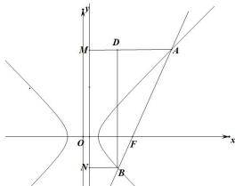

> [!faq]- 全练一本通解析
> **【答案】** B
>
> **【解析】**
> 解析: 设双曲线 $C: \frac{x^2}{a^2} - \frac{y^2}{b^2} = 1$ 的右准线为 $l$ ，
> 过 $A$ 、 $B$ 分别作 $AM \perp l$ 于 $M$ ， $BN \perp l$ 于 $N$ ， $BD \perp AM$ 于 $D$ ，
> 如图所示：
> 
> 因为直线 AB 的斜率为 $\sqrt{3}$ ,
> 所以直线 AB 的倾斜角为 $60^{\circ}$ ,
> 由双曲线的第二定义
> 得： $\left|AM\right|-\left|BN\right|=\left|AD\right|=\frac{1}{e}\left(\left|\overrightarrow{AF}\right|-\left|\overrightarrow{FB}\right|\right)=\frac{1}{2}\left|AB\right|=\frac{1}{2}\left(\left|\overrightarrow{AF}\right|+\left|\overrightarrow{FB}\right|\right)$ ,
> 又∵ $\overrightarrow{AF}=4\overrightarrow{FB}$ ,
> ∴ $\frac{3}{e}\left|\overrightarrow{FB}\right|=\frac{5}{2}\left|\overrightarrow{FB}\right|$ ,
> ∴ $e=\frac{6}{5}$
>
> 故选 **B**
