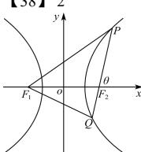

> [!faq]- 全练一本通解析
> **【答案】** B
>
> **【解析】**
> 解析:弦 AB 的中点到 C 的准线的距离 $d=\frac{|AB|}{2}=\frac{\frac{2p}{\sin^{2}\theta}}{2}=\frac{p}{\sin^{2}\theta}=\frac{2}{\sin^{2}\theta}$ ，根据结论 $\left|\cos\theta\right|=\left|\frac{\lambda-1}{\lambda+1}\right|=\left|1-\frac{2}{\lambda+1}\right|\in\left[0,\frac{1}{2}\right]$ ， $\sin^{2}\theta=1-\cos^{2}\theta\in\left[\frac{3}{4},1\right]$ ， $d=\frac{2}{\sin^{2}\theta}\in\left[2,\frac{8}{3}\right]$ ，故选：B.
> 
