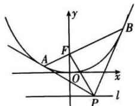

## 3. 抛物线的切线及切点弦

（1）过抛物线 $y^{2}=2px(p>0)$ 上的点 $P(x_{0},y_{0})$ 的切线方程是 $y_{0}y=p(x+x_{0})$ .
（2）过抛物线 $y^{2}=2px(p>0)$ 外一点 $P(x_{0},y_{0})$ 所引两条切线的切点弦方程是 $y_{0}y=p(x+x_{0})$ .
（3）过抛物线 $x^{2}=2py(p>0)$ 上的点 $P(x_{0},y_{0})$ 的切线方程是 $x_{0}x=p(y+y_{0})$ .
（4）过抛物线 $x^{2}=2py(p>0)$ 外一点 $P(x_{0},y_{0})$ 所引两条切线的切点弦方程是 $x_{0}x=p(y+y_{0})$ .

证明切线方程:以椭圆为例
设所求的切线方程为 $y - y_{0} = k(x - x_{0})$ ,
代入椭圆方程得 $b^{2}x^{2} + a^{2}(kx - kx_{0} + y_{0})^{2} = a^{2}b^{2}$ ，即 $\left(k^{2}a^{2}+b^{2}\right)x^{2}-2ka^{2}\left(kx_{0}-y_{0}\right)x+a^{2}\left[\left(kx_{0}-y_{0}\right)^{2}-b^{2}\right]=0$ ①, 因为直线与椭圆相切, 所以方程①有相等的两个实数根, 因此 $\Delta=4k^{2}a^{4}(kx_{0}-y_{0})^{2}-4a^{2}(k^{2}a^{2}+b^{2})\left[(kx_{0}-y_{0})^{2}-b^{2}\right]=0$ 化简得 $k^{2}\left(a^{2}-x_{0}^{2}\right)+2kx_{0}y_{0}+b^{2}-y_{0}^{2}=0$ ②, 因为点 $P(x_{0},y_{0})$ 在椭圆上, 故 $b^{2}x_{0}^{2}+a^{2}y_{0}^{2}=a^{2}b^{2}$ , 方程②的判别式 $\Delta_{1}=4x_{0}^{2}y_{0}^{2}-4\left(a^{2}-x_{0}^{2}\right)\left(b^{2}-y_{0}^{2}\right)$ $=4x_{0}^{2}y_{0}^{2}-4\left(a^{2}b^{2}-b^{2}x_{0}^{2}-a^{2}y_{0}^{2}+x_{0}^{2}y_{0}^{2}\right)=0$ . 故方程
②有相等的两个实数根, 且其根
为: $k=-\frac{x_{0}y_{0}}{a^{2}-x_{0}^{2}}=-\frac{b^{2}x_{0}y_{0}}{a^{2}b^{2}-b^{2}x_{0}^{2}}=-\frac{b^{2}x_{0}y_{0}}{a^{2}y_{0}^{2}}=-\frac{b^{2}x_{0}}{a^{2}y_{0}}.$ 则切线方程为 $y-y_{0}=-\frac{b^{2}x_{0}}{a^{2}y_{0}}(x-x_{0})$ ,
即 $\frac{x_{0}x}{a^{2}}+\frac{y_{0}y}{b^{2}}=1.$

证明切点弦方程:以椭圆为例
设 $P(x_{0},y_{0}), A(x_{1},y_{1}), B(x_{2},y_{2})$ ，根据上一条结论，
过椭圆上一点 A 的切线方程为 $\frac{x_{1}x}{a^{2}} + \frac{y_{1}y}{b^{2}} = 1$ ，同时
直线过点 $P(x_{0},y_{0})$ ，所以 $\frac{x_{1}x_{0}}{a^{2}}+\frac{y_{1}y_{0}}{b^{2}}=1$ ，同理可得$\frac{x_2x_0}{a^2} + \frac{y_2y_0}{b^2} = 1$ ，可以得到 $\left\{ \begin{array}{l} \frac{x_1x_0}{a^2} + \frac{y_1y_0}{b^2} = 1 \\ \frac{x_2x_0}{a^2} + \frac{y_2y_0}{b^2} = 1 \end{array} \right.$ ，直线 $AB$ 分别过点 $A(x_1, y_1), B(x_2, y_2)$ ，满足上述方程组，所以直线 $AB$ 的方程为 $\frac{x_0x}{a^2} + \frac{y_0y}{b^2} = 1$ 。

![[高中/课堂同步/题库/高中数学全练一本通/圆锥曲线/第十二节 专题_圆锥曲线的核心二级结论及解题应用/▶ ▷ 重点题型专练/3. 抛物线的切线及切点弦/questions/Q00008595.md]]
![[高中/课堂同步/题库/高中数学全练一本通/圆锥曲线/第十二节 专题_圆锥曲线的核心二级结论及解题应用/▶ ▷ 重点题型专练/3. 抛物线的切线及切点弦/questions/Q00008596.md]]
![[高中/课堂同步/题库/高中数学全练一本通/圆锥曲线/第十二节 专题_圆锥曲线的核心二级结论及解题应用/▶ ▷ 重点题型专练/3. 抛物线的切线及切点弦/questions/Q00008597.md]]
![[高中/课堂同步/题库/高中数学全练一本通/圆锥曲线/第十二节 专题_圆锥曲线的核心二级结论及解题应用/▶ ▷ 重点题型专练/3. 抛物线的切线及切点弦/questions/Q00008598.md]]
![[高中/课堂同步/题库/高中数学全练一本通/圆锥曲线/第十二节 专题_圆锥曲线的核心二级结论及解题应用/▶ ▷ 重点题型专练/3. 抛物线的切线及切点弦/questions/Q00008599.md]]
![[高中/课堂同步/题库/高中数学全练一本通/圆锥曲线/第十二节 专题_圆锥曲线的核心二级结论及解题应用/▶ ▷ 重点题型专练/3. 抛物线的切线及切点弦/questions/Q00008600.md]]
![[高中/课堂同步/题库/高中数学全练一本通/圆锥曲线/第十二节 专题_圆锥曲线的核心二级结论及解题应用/▶ ▷ 重点题型专练/3. 抛物线的切线及切点弦/questions/Q00008601.md]]
![[高中/课堂同步/题库/高中数学全练一本通/圆锥曲线/第十二节 专题_圆锥曲线的核心二级结论及解题应用/▶ ▷ 重点题型专练/3. 抛物线的切线及切点弦/questions/Q00008602.md]]
![[高中/课堂同步/题库/高中数学全练一本通/圆锥曲线/第十二节 专题_圆锥曲线的核心二级结论及解题应用/▶ ▷ 重点题型专练/3. 抛物线的切线及切点弦/questions/Q00008603.md]]
![[高中/课堂同步/题库/高中数学全练一本通/圆锥曲线/第十二节 专题_圆锥曲线的核心二级结论及解题应用/▶ ▷ 重点题型专练/3. 抛物线的切线及切点弦/questions/Q00008604.md]]
![[高中/课堂同步/题库/高中数学全练一本通/圆锥曲线/第十二节 专题_圆锥曲线的核心二级结论及解题应用/▶ ▷ 重点题型专练/3. 抛物线的切线及切点弦/questions/Q00008605.md]]
![[高中/课堂同步/题库/高中数学全练一本通/圆锥曲线/第十二节 专题_圆锥曲线的核心二级结论及解题应用/▶ ▷ 重点题型专练/3. 抛物线的切线及切点弦/questions/Q00008606.md]]
![[高中/课堂同步/题库/高中数学全练一本通/圆锥曲线/第十二节 专题_圆锥曲线的核心二级结论及解题应用/▶ ▷ 重点题型专练/3. 抛物线的切线及切点弦/questions/Q00008607.md]]
![[高中/课堂同步/题库/高中数学全练一本通/圆锥曲线/第十二节 专题_圆锥曲线的核心二级结论及解题应用/▶ ▷ 重点题型专练/3. 抛物线的切线及切点弦/questions/Q00008608.md]]
![[高中/课堂同步/题库/高中数学全练一本通/圆锥曲线/第十二节 专题_圆锥曲线的核心二级结论及解题应用/▶ ▷ 重点题型专练/3. 抛物线的切线及切点弦/questions/Q00008609.md]]
![[高中/课堂同步/题库/高中数学全练一本通/圆锥曲线/第十二节 专题_圆锥曲线的核心二级结论及解题应用/▶ ▷ 重点题型专练/3. 抛物线的切线及切点弦/questions/Q00008610.md]]

## 结论 7: 阿基米德三角形的常见性质

1. 阿基米德三角形的定义：
抛物线的弦与过弦的端点的两条切线所围成的三角形常被称为阿基米德三角形.

2. 过焦点的阿基米德三角形的常见性质：
如图所示，AB 是抛物线 $x^{2}=2py(p>0)$ 的过焦点的一条弦（焦点弦），分别过 A, B 作抛物线的切线，交于点 P，连接 PF，则有以下结论：

（1）点 P 的轨迹是一条直线, 即抛物线的准线 $l: y = -\frac{p}{2}$

(2) 两切线互相垂直, 即 $PA \perp PB$ ;

$$
P F \perp A B
$$

（4）点 P 的坐标为 $\left(\frac{x_{A}+x_{B}}{2},-\frac{p}{2}\right)$ .

注意:对于阿基米德三角形问题,对于绝大部分同学只需要了解过焦点的阿基米德三角形的常见结论即可.

第十二节 专题：圆锥曲线的核心二级结论及解题应用
![[高中/课堂同步/题库/高中数学全练一本通/圆锥曲线/第十二节 专题_圆锥曲线的核心二级结论及解题应用/▶ ▷ 重点题型专练/3. 抛物线的切线及切点弦/questions/Q00008611.md]]
![[高中/课堂同步/题库/高中数学全练一本通/圆锥曲线/第十二节 专题_圆锥曲线的核心二级结论及解题应用/▶ ▷ 重点题型专练/3. 抛物线的切线及切点弦/questions/Q00008612.md]]
![[高中/课堂同步/题库/高中数学全练一本通/圆锥曲线/第十二节 专题_圆锥曲线的核心二级结论及解题应用/▶ ▷ 重点题型专练/3. 抛物线的切线及切点弦/questions/Q00008613.md]]
![[高中/课堂同步/题库/高中数学全练一本通/圆锥曲线/第十二节 专题_圆锥曲线的核心二级结论及解题应用/▶ ▷ 重点题型专练/3. 抛物线的切线及切点弦/questions/Q00008614.md]]
![[高中/课堂同步/题库/高中数学全练一本通/圆锥曲线/第十二节 专题_圆锥曲线的核心二级结论及解题应用/▶ ▷ 重点题型专练/3. 抛物线的切线及切点弦/questions/Q00008615.md]]
![[高中/课堂同步/题库/高中数学全练一本通/圆锥曲线/第十二节 专题_圆锥曲线的核心二级结论及解题应用/▶ ▷ 重点题型专练/3. 抛物线的切线及切点弦/questions/Q00008616.md]]
![[高中/课堂同步/题库/高中数学全练一本通/圆锥曲线/第十二节 专题_圆锥曲线的核心二级结论及解题应用/▶ ▷ 重点题型专练/3. 抛物线的切线及切点弦/questions/Q00008617.md]]
![[高中/课堂同步/题库/高中数学全练一本通/圆锥曲线/第十二节 专题_圆锥曲线的核心二级结论及解题应用/▶ ▷ 重点题型专练/3. 抛物线的切线及切点弦/questions/Q00008618.md]]
