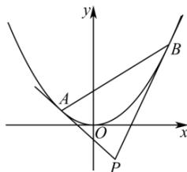

<!-- question-source:start -->
【82】（多选）如图， $\triangle PAB$ 为阿基米德三角形. 抛物线 $x^{2} = 2py(p > 0)$ 上有两个不同的点 $A(x_{1}, y_{1})$ ， $B(x_{2}, y_{2})$ ，以 $A, B$ 为切点的抛物线的切线 $PA, PB$ 相交于点 $P$ . 给出如下结论，其中正确的为（）

A. 若弦 $AB$ 过焦点, 则 $\triangle ABP$ 为直角三角形且 $\angle APB = 90^{\circ}$ B. 点 $P$ 的坐标是 $\left(\frac{x_1 + x_2}{2}, \frac{x_1x_2}{2}\right)$ C. $\triangle PAB$ 的边 $AB$ 所在的直线方程为 $(x_1 + x_2)x - 2py - x_1x_2 = 0$ D. $\triangle PAB$ 的边 $AB$ 上的中线与 $y$ 轴平行（或重合）
<!-- question-source:end -->

![[Q00008616A1]]
