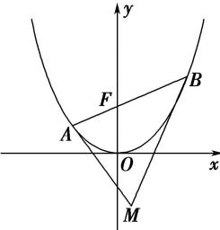

<!-- question-source:start -->
【83】如图所示, 抛物线 $y=\frac{1}{4}x^{2}$ , AB 为过焦点 F 的弦, 过 A, B 分别作抛物线的切线, 两切线交于点 M, 设 $A(x_{A},y_{A})$ , $B(x_{B},y_{B})$ , $M(x_{M},y_{M})$ , 则下列结论正确的有（）

A. 若 $AB$ 的斜率为 1, 则 $|AB| = 8$ B. $|AB|_{\min} = 4$ C. $x_A x_B = -4$ D. 若 $AB$ 的斜率为 1, 则 $x_M = 2$
<!-- question-source:end -->

![[Q00008617A1]]
