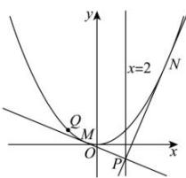

> [!faq]- 全练一本通解析
> **【解析】**
> $[-4,+\infty)$ 解析：解法1：设点P(2, $y_{0}$ )，设M $\left(x_{1},\frac{x_{1}^{2}}{4}\right),N\left(x_{2},\frac{x_{2}^{2}}{4}\right)$ ，根据抛物线切点弦结论，直线MN的方程为 $2x=2(y+y_{0})$ ，即 $x-y-y_{0}=0$ 将直线MN与抛物线联立 $\left\{\begin{aligned}x^{2}&=4y\\ x-y-y_{0}&=0\end{aligned}\right.$ 得 $x_{1}+x_{2}=4$ ， $x_{1}x_{2}=4y_{0}$ $\overline{PM}\cdot\overline{PN}=\left(x_{1}-2,\frac{x_{1}^{2}}{4}-y_{0}\right)\cdot\left(x_{2}-2,\frac{x_{2}^{2}}{4}-y_{0}\right)$ $=x_{1}x_{2}-2\left(x_{1}+x_{2}\right)+4+\frac{\left(x_{1}x_{2}\right)^{2}}{16}-y_{0}\left(\frac{x_{1}^{2}+x_{2}^{2}}{4}\right)+y_{0}^{2}$ $=x_{1}x_{2}-2\left(x_{1}+x_{2}\right)+4+\frac{\left(x_{1}x_{2}\right)^{2}}{16}-y_{0}\left(\frac{\left(x_{1}+x_{2}\right)^{2}-2x_{1}x_{2}}{4}\right)+y_{0}^{2}$ $=4y_{0}-4+y_{0}^{2}-y_{0}\left(\frac{16-8y_{0}}{4}\right)+y_{0}^{2}$ $=4y_{0}-4+y_{0}^{2}-y_{0}\left(4-2y_{0}\right)+y_{0}^{2}$ $=-4+4y_{0}^{2}\geq-4$ 故答案为： $[-4,+\infty)$ 解法2：设M $\left(x_{1},\frac{x_{1}^{2}}{4}\right),N\left(x_{2},\frac{x_{2}^{2}}{4}\right)$ .由 $y=\frac{x^{2}}{4}$ ，求导得 $y^{\prime}=\frac{x}{2}$ ，
> 则直线PM: $y=\frac{x_{1}}{2}x-\frac{x_{1}^{2}}{4}$ ，直线PN: $y=\frac{x_{2}}{2}x-\frac{x_{2}^{2}}{4}$ .
> 由 $\left\{\begin{aligned}y&=\frac{x_{1}}{2}x-\frac{x_{1}^{2}}{4}\\ y&=\frac{x_{2}}{2}x-\frac{x_{2}^{2}}{4},\end{aligned}\right.$ 解得 $\left\{\begin{aligned}x&=\frac{x_{1}+x_{2}}{2}\\ y&=\frac{x_{1}x_{2}}{4},\end{aligned}\right.$ 所以P $\left(\frac{x_ {1}+x_ {2}}{2},\frac{x_ {1}x_ {2}}{4}\right)$ ,
> 又P在直线x=2上，得 $x_ {1}+x _ {2}=4$ .
> 所以 $\overline{PM}\cdot\overline{PN}=\left(\frac{x_ {1}-x_ {2}}{2},\frac{x_ {1}^{2}-x_ {1}x_ {2}}{4}\right)\cdot\left(\frac{x_ {2}-x_ {1}}{2},\frac{x_ {2}^{2}-x_ {1}x_ {2}}{4}\right)$ $=-\frac{(x_ {1}-x _ {2})^{2}}{4}-\frac{x_ {1}x_ {2}(x_ {1}-x _ {2})^{2}}{16}= -\frac{(x_ {1}-x _ {2})^{2}(4+x_ {1}x_ {2})}{16}$ $=-\frac{\left[(x_ {1}+x _ {2})^{2}-4x_ {1}x_ {2}\right](4+x_ {1}x _ {2})}{16}= -\frac{(16-4x_ {1}x _ {2})(x_ {1}x _ {2}+4)}{16}= \frac{(x_ {1}x_ {2})^{2}-16}{4}\geq-4$ 故答案为： $[-4,+\infty)$
> 
