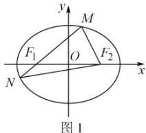
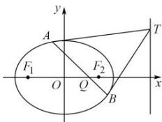

> [!faq]- 全练一本通解析
> **【解析】**
> （1） $\frac{x^2}{4} +\frac{y^2}{3} = 1$ （2）证明见详解.
> 
> 如图 1, 由已知可
> 如图1, 由已知可
> 得， $\left|MF_{2}\right|+\left|NF_{2}\right|+\left|MN\right|=\left|MF_{1}\right|+\left|MF_{2}\right|+\left|NF_{1}\right|+\left|NF_{2}\right|=4a=8$ 所以 a=2.
> 又 2c=2，所以 c=1， $b^{2}=a^{2}-c^{2}=3$ .
> 所以，椭圆 C 的标准方程为 $\frac{x^{2}}{4} + \frac{y^{2}}{3} = 1$ .
> （2）设 $A(x_{1},y_{1})$ ， $B(x_{2},y_{2})$ ， $T(8,t)$ .
> 则由已知可得，AT 方程为： $\frac{x_{1}x}{4}+\frac{y_{1}y}{3}=1$ ，BT 方程为： $\frac{x_{2}x}{4}+\frac{y_{2}y}{3}=1$ 。
> 将 $T(8,t)$ 代入 AT、BT 方程整理可得， $6x_{1}+ty_{1}-3=0$ ， $6x_{2}+ty_{2}-3=0$ 。
> 显然 A、B 点坐标都满足方程 $6x+ty-3=0$ 。
> 即直线 AB 的方程为 $6x+ty-3=0$ ，
> 令 y=0，可得 $x=\frac{1}{2}$ ，即 Q 点坐标为 $\left(\frac{1}{2},0\right)$ .
> 所以，Q 为定点.
> 
> 图2
