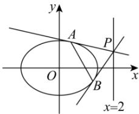

> [!faq]- 全练一本通解析
> **【解析】**
> （1） $\frac{x^{2}}{2} + y^{2} = 1$ ; （2） $\frac{\sqrt{2}}{2}$ .
> 解析：（1）设 M(x, y)，则 $\frac{|x - 2|}{\sqrt{(x - 1)^{2} + y^{2}}} = \sqrt{2}$ ，化简得 $E : \frac{x^{2}}{2} + y^{2} = 1$ ，
> 所以点 M 的轨迹 E 的方程为 $\frac{x^{2}}{2} + y^{2} = 1$ .
> （2）设 $P(2, t), A(x_{1}, y_{1}), B(x_{2}, y_{2})$ ，则切线 AP 为 $\frac{x_{1}x}{2} + y_{1}y = 1$ ，切线 BP 为 $\frac{x_{2}x}{2} + y_{2}y = 1$ ，
> 将点 P 分别代入得 $\left\{\begin{aligned}x_{1} + ty_{1} &= 1 \\ x_{2} + ty_{2} &= 1\end{aligned}\right.$ ，所以直线 AB 为 m: x + ty = 1，
> 点 P 到 m 的距离 $d = \frac{1 + t^{2}}{\sqrt{t^{2} + 1}} = \sqrt{t^{2} + 1}$ ，当 t = 0 时， $d_{\min} = 1$ .
> 另一方面，联立直线 AB 与 E $\left\{\begin{aligned}x + ty &= 1 \\ \frac{x^{2}}{2} + y^{2} &= 1\end{aligned}\right.$ 得 $(t^{2} + 2)y^{2} - 2ty - 1 = 0$ ，
> 所以 $\left\{\begin{aligned}y_{1} + y_{2} &= \frac{2t}{t^{2} + 2}\\ y_{1}y_{2} &= \frac{-1}{t^{2} + 2}\end{aligned}\right.$ 则 $|AB| = \sqrt{1 + t^{2}} \cdot |y_{1} - y_{2}| = \sqrt{1 + t^{2}} \cdot \sqrt{(y_{1} + y_{2})^{2} - 4y_{1}y_{2}}$ $=\frac{2\sqrt{2}(t^{2} + 1)}{t^{2} + 2}=2\sqrt{2}\left(1 - \frac{1}{t^{2} + 2}\right)$ 当 t = 0 时， $|AB|_{\min} = \sqrt{2}$ . 所以 $S_{\triangle ABP} = \frac{1}{2}|AB| \cdot d \geq \frac{\sqrt{2}}{2}$ .
> 故 t = 0 时， $S_{\triangle ABP}$ 最小值为 $\frac{\sqrt{2}}{2}$ .
> 
