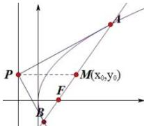

> [!faq]- 全练一本通解析
> **【解析】**
> 解析:法一:如图,
> 
> $P(-3,2)$ 在抛物线 $C:y^{2} = 2px(p > 0)$ 的准线上，故 $p = 6$ ，抛物线 $C:y^2 = 12x$ ，又 $AB$ 中点的纵坐标与 $P$ 点纵坐标相等，即 $y_0 = 2$ ，且 $AB$ 过抛物线的焦点；设 $AB$ 方程为 $x = ky + 3$ ，代入抛物线方程得 $y - 12ky - 36 = 0$ ，故直线 $AB$ 的斜率为3.法二：由阿基米德三角形性质可知， $PF\bot AB$ ，因为 $P(-3,2)$ 在抛物线 $C:y^{2} = 2px(p > 0)$ 的准线上，所以 $p = 6$ ，故抛物线 $C:y^2 = 12x$ ， $F(3,0)$ ， $k_{PF} = \frac{2 - 0}{-3 - 3} = -\frac{1}{3}$ 故直线 $AB$ 的斜率为3.
