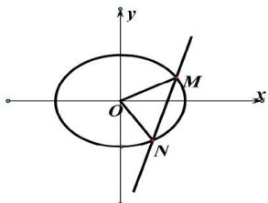

<!-- question-source:start -->
【16】已知椭圆 $C:\frac{x^{2}}{a^{2}}+\frac{y^{2}}{b^{2}}=1(a>b>0)$ . 离心率为 $\frac{1}{2}$ ，点 $G(0,2)$ 与椭圆的左、右顶点可以构成等腰直角三角形.

(1) 求椭圆 C 的方程;

(2) 若直线 $y = kx + m$ 与椭圆 C 交于 M, N 两点, O 为坐标原点直线 OM, ON 的斜率之积等于 $-\frac{3}{4}$ , 试探求 $\triangle OMN$ 的面积是否为定值, 并说明理由.

<!-- question-source:end -->

![[Q00008656A1]]
