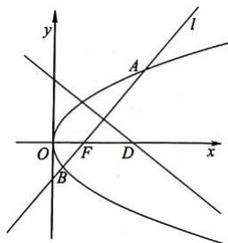

<!-- question-source:start -->
【19】如图, 过抛物线 $y^{2}=4x$ 的焦点 F 任作直线 l, 与抛物线交于 A, B 两点, AB 与 x 轴不垂直, 且点 A 位于 x 轴上方. AB 的垂直平分线与 x 轴交于 D 点.

（1）若 $\overrightarrow{AF}=2\overrightarrow{FB}$ ，求 AB 所在的直线方程；

(2) 求证: $\frac{|AB|}{|DF|}$ 为定值.

第十五节 专题:圆锥曲线中的定值问题
<!-- question-source:end -->
