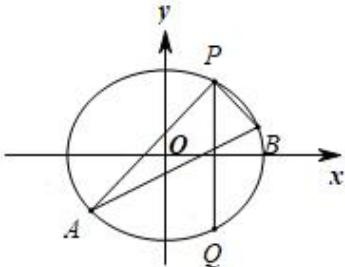

<!-- question-source:start -->
【11】已知椭圆 C 的中点在原点, 焦点在 x 轴上, 离心率等于 $\frac{1}{2}$ , 它的一个顶点恰好是抛物线 $x^{2} = 8\sqrt{3}y$ 的焦点.

（1）求椭圆 C 的方程；

(2) 已知点 $P(2,3)$ , $Q(2,-3)$ 在椭圆上, 点 A、B 是椭圆上不同的两个动点, 且满足 $\angle APQ = \angle BPQ$ , 试问直线 AB 的斜率是否为定值, 请说明理由.

第十五节 专题: 圆锥曲线中的定值问题
<!-- question-source:end -->
