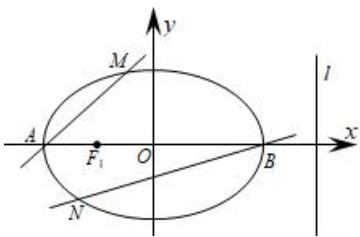

<!-- question-source:start -->
【12】如图所示, 椭圆 $C: \frac{x^{2}}{a^{2}} + \frac{y^{2}}{b^{2}} = 1 (a > b > 0)$ 的离心率为 $\frac{1}{2}$ , 其右准线方程为 x = 4, A、B 分别为椭圆的左、右顶点, 过点 A、B 作斜率分别为 $k_{1}$ 、 $k_{2}$ , 直线 AM 和直线 BN 分别与椭圆 C 交于点 M, N（其中 M 在 x 轴上方, N 在 x 轴下方）.

(1) 求椭圆 C 的方程;

(2) 若直线 MN 恒过椭圆的左焦点 $F_{1}$ , 求证: $\frac{k_{1}}{k_{2}}$ 为定值.

<!-- question-source:end -->
