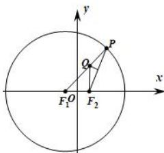

> [!faq]- 全练一本通解析
> **【答案】** （1） $\frac{x^2}{4} + \frac{y^2}{3} = 1$ （2） $\left(-\infty, -\frac{\sqrt{15}}{5}\right) \cup \left(\frac{\sqrt{15}}{5}, +\infty\right)$
>
> **【解析】**
> （1）由题意可知： $|PQ| + |QF_1| = |PF_1| = r = 4$ ，由 $F_2P$ 的中垂线 $l$ 交 $F_1P$ 于点 $Q$ ，则 $\left|QF_2\right| = |PQ|$ ， $\therefore |QF_2| + |QF_1| = 4 > |F_1F_2| = 2$ ，则点 $Q$ 的轨迹 $E$ 为以 $F_1$ ， $F_2$ 为焦点，4为长轴长的椭圆，即 $2a = 4$ ， $2c = 2$ ， $b^2 = a^2 - c^2 = 3$ ，∴ 点 $Q$ 的轨迹 $E$ 的方程为： $\frac{x^2}{4} + \frac{y^2}{3} = 1$ ；
> 
> （2）设直线 $l_{1}: y = kx + m$ ， $A(x_{1}, y_{1})$ ， $B(x_{2}, y_{2})$ ，将 $y = kx + m$ 代入椭圆方程，消去 y 得 $\left(3 + 4k^{2}\right)x^{2} + 8kmx + 4m^{2} - 12 = 0$ ，
> 所以 $\Delta=(8km)^{2}-4\left(3+4k^{2}\right)\left(4m^{2}-12\right)>0$ ，即 $m^{2}<4k^{2}+3$ ①，
> 由根与系数关系得 $x_{1}+x_{2}=-\frac{8km}{3+4k^{2}}$ ，则 $y_{1}+y_{2}=k(x_{1}+x_{2})+2m=\frac{6m}{3+4k^{2}}$ 所以线段 AB 的中点 M 的坐标为 $\left(-\frac{4km}{3+4k^{2}},\frac{3m}{3+4k^{2}}\right)$ .
> 又线段 AB 的垂直平分线 $l'$ 的方程为 $y=-\frac{1}{k}\left(x-\frac{1}{3}\right)$ ,
> 由点 M 在直线 $l'$ 上, 得 $\frac{3m}{3+4k^{2}}=-\frac{1}{k}\left(-\frac{4km}{3+4k^{2}}-\frac{1}{3}\right)$ ,
> 即 $4k^{2}+3km+3=0$ ，所以 $m=-\frac{1}{3k}(4k^{2}+3)$ ②，
> 由①②得 $\frac{\left(4k^{2}+3\right)^{2}}{9k^{2}}<4k^{2}+3$ ∵ $4k^{2} + 3 > 0$ , ∴ $4k^{2} + 3 < 9k^{2}$ , 所以 $k^{2} > \frac{3}{5}$ , 即 $k < -\frac{\sqrt{15}}{5}$ 或 $k > \frac{\sqrt{15}}{5}$ ,
> 所以实数 k 的取值范围是 $\left(-\infty,-\frac{\sqrt{15}}{5}\right)\cup\left(\frac{\sqrt{15}}{5},+\infty\right)$ .
