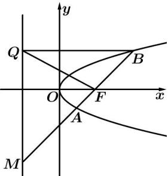

<!-- question-source:start -->
【9】如图, 已知 $F(1,0)$ , 直线 l: x = -1, P 是平面上的动点, 过点 P 作 l 的垂线, 垂足为点 Q, 且 $\overrightarrow{QP} \cdot \overrightarrow{QF} = \overrightarrow{FP} \cdot \overrightarrow{FQ}$ .

（1）求动点 P 的轨迹 C 的方程；

（2）过点 F 的直线交轨迹 C 于 A、B 两点，交直线 l 于点 M；
①已知 $\overrightarrow{MA} = \lambda_{1}\overrightarrow{AF}, \overrightarrow{MB} = \lambda_{2}\overrightarrow{BF}$ ，求 $\lambda_{1} + \lambda_{2}$ 的值；
②求 $\left|\overrightarrow{MA}\right| \cdot \left|\overrightarrow{MB}\right|$ 的最小值.

第十八节 专题: 圆锥曲线中的范围与最值问题
<!-- question-source:end -->

![[Q00008723A1]]
