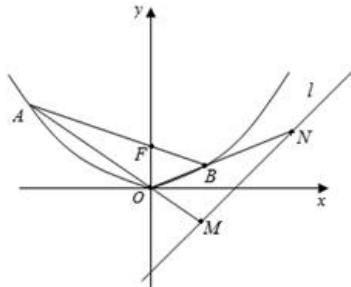

<!-- question-source:start -->
【13】已知抛物线 C 的顶点为 $O(0,0)$ ，焦点 $F(0,1)$ .
（1）求抛物线 C 的方程；

(2) 过 F 作直线交抛物线于 A, B 两点. 若直线 OA、OB 分别交直线 l: y = x - 2 于 M、N 两点, 求 $\left|MN\right|$ 的最小值.

第十八节 专题: 圆锥曲线中的范围与最值问题
<!-- question-source:end -->

![[Q00008727A1]]
