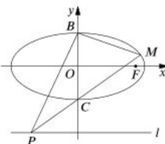

<!-- question-source:start -->
【4】如图, 已如椭圆 $O: \frac{x^{2}}{4} + y^{2} = 1$ 的右焦点为 F, 点 B, C 分别是椭圆 O 的上、下顶点, 点 P 是直线 l: y = -2 上的一个动点（与 y 轴交点除外）, 直线 PC 交椭圆于另一点 M.

（1）若直线 PM 过椭圆的右焦点 F, 求 $\triangle FBM$ 的面积;

（2）记直线 BM, BP 的斜率分别为 $k_{1}, k_{2}$ , 求证: $k_{1} \cdot k_{2}$ 为定值.

（3）求 $\overrightarrow{BP}, \overrightarrow{PM}$ 的取值范围.

（3）求 $\overrightarrow{PB} \cdot \overrightarrow{PM}$ 的取值范围.
<!-- question-source:end -->
