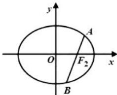

> [!faq]- 全练一本通解析
> **【答案】** （1） $\frac{x^{2}}{4}+\frac{y^{2}}{3}=1$ （2）存在； $M\left(\frac{11}{8},0\right)$ ，该定值为 $-\frac{135}{64}$
>
> **【解析】**
> （1）由题意知 $\left\{\begin{aligned}\frac{c}{a}&=\frac{1}{2}\\ \frac{2}{a^{2}}+\frac{\frac{3}{2}}{b^{2}}&=1\end{aligned}\right.\Rightarrow\left\{\begin{aligned}a&=2\\ b&=\sqrt{3}\end{aligned}\right.$ ，∴椭圆C的方程为 $\frac{x^{2}}{4}+\frac{y^{2}}{3}=1$ .
> （2）设直线 $AB$ 的方程为 $x = my + 1$ ， $A(x_{1},y_{1})$ ， $B(x_{2},y_{2})$
> 
> $\left\{ \begin{array}{l} x = my + 1 \\ 3x^{2} + 4y^{2} = 12 \end{array} \right. \Rightarrow 3\left( m^{2}y^{2} + 2my + 1 \right) + 4y^{2} = 12$ ，即 $\left(3m^{2} + 4\right)y^{2} + 6my - 9 = 0$ ，
> 所以 $y_{1} + y_{2} = -\frac{6m}{3m^{2} + 4}y_{1}y_{2} = -\frac{9}{3m^{2} + 4}$ 假设存在这样的 $M(t,0)$ 符合题意，则 $\overline{MA} = (x_{1} - t,y_{1})$ ， $\overline{MB} = (x_{2} - t,y_{2})$ $\overline{MA} \cdot \overline{MB} = (x_{1} - t)(x_{2} - t) + y_{1}y_{2} = (my_{1} + 1 - t)(my_{2} + 1 - t) + y_{1}y_{2}$ $= (m^{2} + 1)y_{1}y_{2} + m(1 - t)(y_{1} + y_{2}) + (1 - t)^{2}$ $= (m^{2} + 1) \cdot \frac{-9}{3m^{2} + 4} + m(1 - t) \cdot \frac{-6m}{3m^{2} + 4} + (1 - t)^{2}$ $= \frac{-9m^{2} - 9 - 6m^{2} + 6m^{2} + 3m^{2} - 6m^{2}t + 3m^{2}t^{2} + 4 - 8t + 4t^{2}}{3m^{2} + 4}$ $= \frac{(3t^{2} - 12)m^{2} + 4t^{2} - 8t - 5}{3m^{2} + 4}$ ，要使其为定值，则 $\frac{3t^{2} - 12}{3} = \frac{4t^{2} - 8t - 5}{4}$ ，解得 $t = \frac{11}{8}$ . $\therefore$ 存在 $M\left(\frac{11}{8},0\right)$ 符合题意，该定值为 $-\frac{135}{64}$ .
