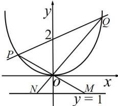

> [!faq]- 全练一本通解析
> **【解析】**
> （1） $x^{2} = 2y(x\neq \pm 2)$ ；（2）存在， $\lambda = 4$ 解析：（1）设 $D(x,y)$ ，由 $A(-2,2),B(2,2)$ ，得 $k_{AD} = \frac{y - 2}{x + 2},k_{BD} = \frac{y - 2}{x - 2},$ $\because k_{AD} - k_{BD} = -2,\therefore \frac{y - 2}{x + 2} -\frac{y - 2}{x - 2} = -2,$ 整理得： $x^{2} = 2y(x\neq \pm 2)$ （2）存在常数 $\lambda = 4$ ，使 $S_{\triangle OPQ} = \lambda S_{\triangle OMN}$ .证明如下：由题意，直线 $l$ 的斜率存在，且过点 $(0,2)$ 设直线 $l$ 的方程为 $y = kx + 2$ ， $P(x_{1},x_{2}),Q(x_{2},y_{2})$ 联立 $\left\{ \begin{array}{l}y = kx + 2\\ x^2 = 2y \end{array} \right.$ ，得 $x^{2} - 2kx - 4 = 0$ 由韦达定理得， $x_{1} + x_{2} = 2k$ ， $x_{1}x_{2} = -4.$ $|x_{1} - x_{2}| = \sqrt{(x_{1} + x_{2})^{2} - 4x_{1}x_{2}} = \sqrt{4k^{2} + 16} = 2\sqrt{k^{2} + 4}$ 所以 $S_{\triangle OPQ} = \frac{1}{2}\cdot 2\cdot |x_1 - x_2| = 2\sqrt{k^2 + 4}$
> 直线 OP 的方程为 $y=\frac{y_{1}}{x_{1}}x$ ，取 y=-1，得 $x_{M}=-\frac{x_{1}}{y_{1}}$ 直线 OQ 的方程为 $y=\frac{y_{2}}{x_{2}}x$ ，取 y=-1，得 $x_{N}=-\frac{x_{2}}{y_{2}}$ .
> 所以 $\left|x_{M}-x_{N}\right|=\left|\frac{x_{2}}{y_{2}}-\frac{x_{1}}{y_{1}}\right|=\left|\frac{x_{2}y_{1}-x_{1}y_{2}}{y_{1}y_{2}}\right|=\frac{\left|x_{2}(kx_{1}+2)-x_{1}(kx_{2}+2)\right|}{\left|(kx_{1}+2)(kx_{2}+2)\right|}$ $=\frac{\left|2(x_{2}-x_{1})\right|}{\left|k^{2}\cdot x_{1}x_{2}+2k(x_{1}+x_{2})+4\right|}=\frac{4\sqrt{k^{2}+4}}{4}=\sqrt{k^{2}+4}$ $\therefore S_{\triangle OMN}=\frac{1}{2}\cdot1\cdot\left|x_{M}-x_{N}\right|=\frac{\sqrt{k^{2}+4}}{2}$ $\therefore S_{\triangle OPQ}=4S_{\triangle OMN}$ . 故存在常数 $\lambda=4$ ，使 $S_{\triangle OPQ}=\lambda S_{\triangle OMN}$ .
> 
