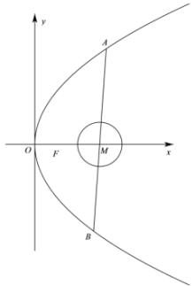

<!-- question-source:start -->
【15】已知抛物线 $y^{2}=8x$ 的焦点为 F，半径为 1 的圆 M 的圆心位于 x 轴的正半轴上，过圆心 M 的动直线 l 与抛物线交于 A、B 两点，如图所示.
(1) 若圆 M 经过抛物线 $\Gamma$ 的焦点 F，且圆心位于焦点的右侧，求圆 M 的方程；
（2）是否存在定点 M，使得 $\frac{1}{|MA|} + \frac{1}{|MB|}$ 为定值，若存在，试求出该定点 M 的坐标，若不存在，则说明理由.

第十六节 专题: 圆锥曲线中的存在性问题
<!-- question-source:end -->
