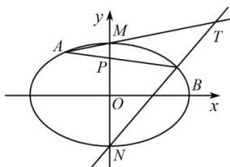

<!-- question-source:start -->
【1】如图, 椭圆 $C: \frac{x^{2}}{a^{2}} + \frac{y^{2}}{b^{2}} = 1 (a > b > 0)$ 的焦距等于其长半轴长, M, N 为椭圆 C 的上、下顶点, 且 $|MN| = 2\sqrt{3}$

（1）求椭圆 C 的方程；

（2）过点 $P(0,1)$ 作直线 $l$ 交椭圆 $C$ 于异于 $M, N$ 的 $A, B$ 两点，直线 $AM, BN$ 交于点 $T$ . 求证：点 $T$ 的纵坐标为定值3.

<!-- question-source:end -->

![[Q00008631A1]]
