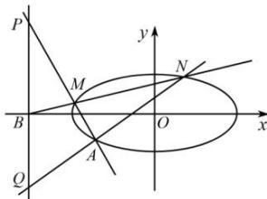

<!-- question-source:start -->
【10】已知椭圆 $C:\frac{x^{2}}{a^{2}}+\frac{y^{2}}{b^{2}}=1$ 过点 A(-2,-1)，且 a=2b.

（1）求椭圆 C 的方程；

（2）过点 $B(-4,0)$ 的直线 $l$ 交椭圆 $C$ 于点 $M, N$ ，直线 $MA, NA$ 分别交直线 $x = -4$ 于点 $P, Q$ . 求 $\frac{|PB|}{|BQ|}$ 的值.

<!-- question-source:end -->
