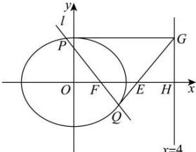

> [!faq]- 全练一本通解析
> **【答案】** （1） $\frac{x^{2}}{4}+\frac{y^{2}}{3}=1$ （2）椭圆 C 具有“过中”性质，理由见解析
>
> **【解析】**
> （1）由题意， $\left\{\begin{aligned}\frac{\left(\sqrt{2}\right)^{2}}{a^{2}}+\frac{\left(\frac{\sqrt{6}}{2}\right)^{2}}{b^{2}}=1,\text { 解得 }a^{2}=4,b^{2}=3,\end{aligned}\right.$
> 所以求椭圆 C 的方程为 $\frac{x^{2}}{4} + \frac{y^{2}}{3} = 1$ .
> （2）椭圆 C 具有“过中”性质，理由如下：
> 椭圆的右准线方程为 x = 4，与 x 轴交于点 $H(4,0)$ ，
> 设过焦点 $F(1,0)$ 的直线为 l，与椭圆 C 交于 $P(x_{1},y_{1}), Q(x_{2},y_{2})$ ，
> 过 P 点作 $PG \perp$ 准线 x = 4，垂足为 $G(4, y_{1})$ ，连接 QG 与 x 轴交于点 E，
> 易知直线 l 的斜率不为 0，设直线 l 的方程为 $x = my + 1$ 联立 $\left\{\begin{aligned}x&=my+1\\ \frac{x^{2}}{4}&+\frac{y^{2}}{3}=1\end{aligned}\right.$ ，得 $(3m^{2}+4)y^{2}+6my-9=0$ 则 $\Delta=36m^{2}+36(3m^{2}+4)>0$ $y_{1}+y_{2}=-\frac{6m}{3m^{2}+4},y_{1}y_{2}=-\frac{9}{3m^{2}+4}$ 又 $k_{GQ}=\frac{y_{2}-y_{1}}{x_{2}-4}$ ，则直线 GQ 的方程为 $y-y_{1}=\frac{y_{2}-y_{1}}{x_{2}-4}(x-4)$ ，
> 令 y=0 ，得 $x=4-\frac{y_{1}(x_{2}-4)}{y_{2}-y_{1}}=4-\frac{y_{1}(my_{2}+1)-4y_{1}}{y_{2}-y_{1}}=4-\frac{my_{1}y_{2}-3y_{1}}{y_{2}-y_{1}}$ 又 $my_{1}y_{2}=-\frac{9m}{3m^{2}+4}=\frac{3}{2}(y_{1}+y_{2})$ 所以上式 $x=4-\frac{my_{1}y_{2}-3y_{1}}{y_{2}-y_{1}}=4-\frac{\frac{3}{2}(y_{1}+y_{2})-3y_{1}}{y_{2}-y_{1}}=4-\frac{\frac{3}{2}(y_{2}-y_{1})}{y_{2}-y_{1}}=4-\frac{3}{2}=\frac{5}{2}$ 所以直线 GQ 与 x 轴交点为 $E\left(\frac{5}{2},0\right)$ ，刚好为 $H(4,0)$ 和 $F(1,0)$ 的中点，
> 所以椭圆 C 具有“过中”性质.
> 
