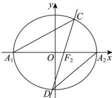

> [!faq]- 全练一本通解析
> **【答案】** （1） $E$ 与圆 $O: x^2 + y^2 = 8$ 相切，理由见解析（2） $\left(0, \frac{1}{4}\right)$ （3）是定值，定值为 $\frac{2}{5}$
>
> **【解析】**
> （1）因为 $|MF_1| + |MF_2| = 3|F_1F_2| = 6 > |F_1F_2|$ ，所以 $E$ 是以 $F_1$ ， $F_2$ 为分点，且长轴长为6的椭圆.
> 设 $E$ 的方程为 $\frac{x^2}{a^2} + \frac{y^2}{b^2} = 1 (a > b > 0)$ ，则 $2a = 6$ ，可得 $a = 3$ ，又 $c = 1$ ，所以 $b^2 = a^2 - c^2 = 8$ ，所以曲线 $E$ 的方程为： $\frac{x^2}{9} + \frac{y^2}{8} = 1$ ，
> 联立 $\frac{x^2}{9} + \frac{y^2}{8} = 1$ 与 $x^2 + y^2 = 8$ ，得 $x = 0$ ， $y = \pm 2\sqrt{2}$ ，
> 所以 $E$ 与圆 $O: x^2 + y^2 = 8$ 有两个公共点，故 $E$ 与圆 $O: x^2 + y^2 = 8$ 相切.
> （2） $\triangle PF_1F_2$ 的周长 $l = |PF_1| + |PF_2| + |F_1F_2| = 6 + 2 = 8$ ， $\triangle PF_1F_2$ 的面积 $S = \frac{1}{2}|F_1F_2| \cdot d = d \in (0,1)$ ，
> 所以 $\triangle PF_1F_2$ 内切圆的半径 $r = \frac{2S}{l} = \frac{1}{4}d \in \left(0, \frac{1}{4}\right)$ ，
> 故 $\triangle PF_1F_2$ 内切圆的半径的取值范围为 $\left(0, \frac{1}{4}\right)$ .
> （3）方法一：联立 $\left\{\begin{array}{l} \frac{x^2}{9} + \frac{y^2}{8} = 1 \\ y = k(x - 1) \end{array}\right.$ ，得 $(8 + 9k^2)x^2 - 18k^2x + 9(k^2 - 8) = 0$ ，
> 设 $C(x_1y_1), D(x_2,y_2)$ ，
> 易知 $\Delta > 0$ ，且 $x_1 + x_2 = \frac{18k^2}{8 + 9k^2}$ ， $x_1x_2 = \frac{9(k^2 - 8)}{8 + 9k^2}$ .
> 则 $k_1 = \frac{y_1}{x_1 + 3}, k_2 = \frac{y_2}{x_2 - 3}$ ，
> 所以 $\frac{k_1}{k_2} = \frac{y_1(x_2 - 3)}{y_2(x_1 + 3)} = \frac{k(x_1 - 1)(x_2 - 3)}{k(x_2 - 1)(x_1 + 3)} = \frac{x_1x_2 - 3x_1 - x_2 + 3}{x_1x_2 - x_1 + 3x_2 - 3}$ .
> 由 $x_1 + x_2 = \frac{18k^2}{8 + 9k^2}$ ， $x_1x_2 = \frac{9(k^2 - 8)}{8 + 9k^2}$ ，得 $x_1x_2 = 5(x_1 + x_2) - 9$ ，
> 所以 $\frac{k_1}{k_2} = \frac{5(x_1 + x_2) - 9 - 3x_1 - x_2 + 3}{5(x_1 + x_2) - 9 - x_1 + 3x_2 - 3} = \frac{2x_1 + 4x_2 - 6}{4x_1 + 8x_2 - 12} = \frac{1}{2}$ ，
> 所以 $\frac{k_1k_2}{k_1^2 + k_2^2} = \frac{1}{\frac{k_1}{k_2} + \frac{k_2}{k_1}} = \frac{1}{\frac{1}{2} + 2} = \frac{2}{5}$ ，
> 故 $\frac{k_1k_2}{k_1^2 + k_2^2}$ 为定值，且定值为 $\frac{2}{5}$ .
> 
> 方法二:联立 $\left\{\frac{x^{2}}{9}+\frac{y^{2}}{8}=1\right.$ ，得 $\left(8+9k^{2}\right)x^{2}-18k^{2}x+9\left(k^{2}-8\right)=0$ ，
> 设 $C(x_{1}y_{1}), D(x_{2}, y_{2})$ ,
> 易知 $\Delta>0$ ，且 $x_{1}+x_{2}=\frac{18k^{2}}{8+9k^{2}}$ ， $x_{1}x_{2}=\frac{9\left(k^{2}-8\right)}{8+9k^{2}}$
> 则 $k_{1}=\frac{y_{1}}{x_{1}+3},k_{2}=\frac{y_{2}}{x_{2}-3}$ 因为 $\frac{k_{1}}{k_{2}}=\frac{\frac{y_{1}}{x_{1}+3}}{\frac{y_{2}}{x_{2}-3}}=\frac{y_{1}(x_{2}-3)}{y_{2}(x_{1}+3)}=\frac{x_{1}x_{2}-3(x_{1}+x_{2})+2x_{2}+3}{x_{1}x_{2}-(x_{1}+x_{2})+4x_{2}-3}$ $=\frac{9(k^{2}-8)}{8+9k^{2}}-\frac{54k^{2}}{8+9k^{2}}+2x_{2}+3=\frac{9(k^{2}-8)-54k^{2}+3(8+9k^{2})}{8+9k^{2}}+\frac{2x_{2}}{8+9k^{2}}$ $\frac{9(k^{2}-8)}{8+9k^{2}}-\frac{18k^{2}}{8+9k^{2}}+4x_{2}-3=\frac{-18k^{2}-48}{8+9k^{2}}+2x_{2}$ $=\frac{-18k^{2}-48}{-36k^{2}-96}/4x_{2}=\frac{1}{2}$ 所以 $\frac{k_{1}k_{2}}{k_{1}^{2}+k_{2}^{2}}=\frac{1}{\frac{k_{1}}{k_{2}}+\frac{k_{2}}{k_{1}}}=\frac{1}{\frac{1}{2}+2}=\frac{2}{5}$ 故 $\frac{k_{1}k_{2}}{k_{1}^{2}+k_{2}^{2}}$ 为定值，且定值为 $\frac{2}{5}$ .
