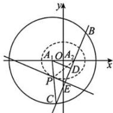
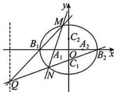
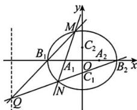
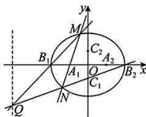

> [!faq]- 全练一本通解析
> **【解析】**
> （1） $y=\pm\sqrt{3}(x-1)$ ; （2） $\Gamma:\frac{x^{2}}{4}+\frac{y^{2}}{3}=1(x\neq\pm2)$ ; （3）4
> 解析：（1）设直线 $l_{1}$ 的斜率为 k，直线方程为 $y=k(x-1)$ ，因为 $A_{1}$ 到直线 $l_{1}$ 的距离为 $\sqrt{3}$ ，则 $d=\frac{|-2k|}{\sqrt{k^{2}+1}}=\sqrt{3}$ ，解得 $k=\pm\sqrt{3}$ ，所以直线 $l_{1}$ 的方程为 $y=\pm\sqrt{3}(x-1)$ .
> （2）由题意得， $A_{1}(-1,0),A_{2}(1,0)$ .
> 因为 D 为 BC 中点，所以 $A_{1}D \perp BC$ ，即 $A_{1}D \perp A_{2}C$ ，
> 又 PE // $A_{1}D$ ，所以 PE ⊥ $A_{2}C$ ，
> 又 E 为 $A_{2}C$ 的中点，所以 $|PA_{2}|=|PC|$ ，
> 所以 $|PA_{1}|+|PA_{2}|=|PA_{1}|+|PC|=|A_{1}C|=4>\left|A_{1}A_{2}\right|$ ，
> 所以点 P 的轨迹 $\Gamma$ 是以 $A_{1},A_{2}$ 为焦点的椭圆（左、右顶点除外）.
> 设 $\Gamma:\frac{x^{2}}{a^{2}}+\frac{y^{2}}{b^{2}}=1(x\neq\pm a)$ ，其中 $a>b>0,a^{2}-b^{2}=c^{2}$ .
> 则 $2a=4,a=2,c=1,b=\sqrt{a^{2}-c^{2}}=\sqrt{3}$ 故 $\Gamma:\frac{x^{2}}{4}+\frac{y^{2}}{3}=1(x\neq\pm2)$
> 
> （3）思路一：由题意得， $B_{1}(-2,0),B_{2}(2,0),C_{1}(0,-1),C_{2}(0,1)$ ，且直线 $l_{2}$ 的斜率不为0，
> 可设直线 $l_{2}:x=my-1,M(x_{1},y_{1}),N(x_{2},y_{2})$ ，且 $x_{1}\neq\pm2,x_{2}\neq\pm2$ 由 $\left\{\begin{aligned}\frac{x^{2}}{4}+\frac{y^{2}}{3}=1,\\ x=my-1\end{aligned}\right.$ ，得 $(3m^{2}+4)y^{2}-6my-9=0$ 所以 $y_{1} + y_{2} = \frac{6m}{3m^{2} + 4}, y_{1}y_{2} = \frac{-9}{3m^{2} + 4}$ ，所以 $2my_{1}y_{2} = -3(y_{1} + y_{2})$ .
> 直线 $B_{1}M$ 的方程为： $y=\frac{y_{1}}{x_{1}-2}(x+2)$ ，直线 $B_{2}N$ 的方程
> 为： $y=\frac{y_{2}}{x_{2}-2}(x-2)$ ,
> 由 $\left\{\begin{aligned}y=\frac{y_{1}}{x_{1}+2}(x+2)\\ y=\frac{y_{2}}{x_{2}-2}(x-2)\end{aligned}\right.$ ，得 $\frac{x+2}{x-2}=\frac{y_{2}(x_{1}+2)}{y_{1}(x_{2}-2)}$ $=\frac{y_{2}(my_{1}+1)}{y_{1}(my_{2}-3)}=\frac{my_{1}y_{2}+y_{2}}{my_{1}y_{2}-3y_{1}}=\frac{-\frac{3}{2}(y_{1}+y_{2})+y_{2}}{-\frac{3}{2}(y_{1}+y_{2})-3y_{1}}=\frac{-\frac{3}{2}y_{1}-\frac{1}{2}y_{2}}{-\frac{9}{2}y_{1}-\frac{3}{2}y_{2}}=\frac{1}{3}\right.$ 解得 x=-4.
> 故点 Q 在直线 x=-4，所以 Q 到 $C_{1}C_{2}$ 的距离 d=4，
> 因此 $\triangle QC_1C_2$ 的面积是定值，为 $\frac{1}{2}\left|C_1C_2\right|\cdot d = \frac{1}{2}\times 2\times 4 = 4$
> 
> 思路二：由题意得， $B_{1}(-2,0),B_{2}(2,0),C_{1}(0, - 1),C_{2}(0,1)$ ，且直线 $l_{2}$ 的斜率不为0，
> 可设直线 $l_{2}:x = my - 1,M(x_{1},y_{1}),N(x_{2},y_{2})$ ，且 $x_{1}\neq \pm 2,x_{2}\neq \pm 2$ ：
> 由 $\left\{\frac{x^2}{4} +\frac{y^2}{3} = 1\right.$ 得 $(3m^{2} + 4)y^{2} - 6my - 9 = 0$ ， $x = my - 1$ 所以 $y_{1} + y_{2} = \frac{6m}{3m^{2} + 4},y_{1}y_{2} = \frac{-9}{3m^{2} + 4}$ 所以 $2my_1y_2 = -3(y_1 + y_2)$ ：
> 
> 直线 $B_{1}M$ 的方程为： $y = \frac{y_1}{x_1 + 2}(x + 2)$ ，直线 $B_{2}N$ 的方程为： $y = \frac{y_2}{x_2 - 2}(x - 2)$ ，由 $\left\{ \begin{array}{l} y = \frac{y_1}{x_1 + 2}(x + 2) \\ y = \frac{y_2}{x_2 - 2}(x - 2) \end{array} \right.$ ，得 $x = 2\left[\frac{y_2(y_1 + 1) + y_1(y_2 - 2)}{y_2(y_1 + 2) - y_1(y_2 - 2)}\right] = 2\left[\frac{y_2(my_1 + 1) + y_1(my_2 - 3)}{y_2(my_1 + 1) - y_1(my_2 - 3)}\right] = 2\left(\frac{2my_1y_2 + y_2 - 3y_1}{y_2 + 3y_1}\right) = 2\left[\frac{2my_1y_2 + 3(y_1 + y_2) - 2(y_2 + 3y_1)}{y_2 + 3y_1}\right] = -4$ ，故点 $Q$ 在直线 $x = -4$ ，所以 $Q$ 到 $C_1C_2$ 的距离 $d = 4$ ，因此 $\triangle QC_1C_2$ 的面积是定值，为 $\frac{1}{2}|C_1C_2| \cdot d = \frac{1}{2} \times 2 \times 4 = 4$ 。
> 
> 思路三:由题意得, $B_{1}(-2,0),B_{2}(2,0),C_{1}(0,-1),C_{2}(0,1)$ ，且直线 $l_{2}$ 的斜率不为0.
> （i）当直线 $l_{2}$ 垂直于 x 轴时， $l_{2}:x=-1$ ，由 $\left\{\begin{aligned}\frac{x^{2}}{4}+\frac{y^{2}}{3}=1\\x=-1\end{aligned}\right.$ 得 $\left\{\begin{aligned}x&=-1\\ y&=-\frac{3}{2}\end{aligned}\right.$ 或 $\left\{\begin{aligned}x&=-1\\ y&=\frac{3}{2}\end{aligned}\right.$ 不妨设 $M\left(-1,\frac{3}{2}\right),N\left(-1,-\frac{3}{2}\right)$ ,
> 则直线 $B_{1}M$ 的方程为： $y=\frac{3}{2}(x+2)$ ，直线 $B_{2}N$ 的方程为： $y=\frac{1}{2}(x-2)$ ，
> 由 $\left\{\begin{aligned}y=\frac{3}{2}(x+2)\\ y=\frac{1}{2}(x-2)\end{aligned}\right.$ 得， $\left\{\begin{aligned}x&=-4\\ y&=-3\end{aligned}\right.$ ，所以 $Q(-4,-3)$ ，
> 故 Q 到 $C_{1}C_{2}$ 的距离 d=4，此时 $\triangle QC_{1}C_{2}$ 的面积是
> $\frac{1}{2}\left|C_1C_2\right|\cdot d = \frac{1}{2}\times 2\times 4 = 4$ （ii）当直线 $l_{2}$ 不垂直于 $x$ 轴时，设直线 $l_{2}:y = k(x + 1),M(x_{1},y_{1}),N(x_{2},y_{2})$ ，且 $x_{1}\neq \pm 2,x_{2}\neq \pm 2$ 由 $\left\{\frac{x^2}{4} +\frac{y^2}{3} = 1\right.$ 得 $(4k^{2} + 3)x^{2} + 8k^{2}x + (4k^{2} - 12) = 0$ ，所以 $x_{1} + x_{2} = \frac{-8k^{2}}{4k^{2} + 3},x_{1}x_{2} = \frac{4k^{2} - 12}{4k^{2} + 3}$ 直线 $MB_{1}$ 的方程为： $y = \frac{y_1}{x_1 + 2}(x + 2)$ ，直线 $MB_{2}$ 的方程为： $y = \frac{y_2}{x_2 - 2}(x - 2)$ ，由 $\left\{y = \frac{y_1}{x_1 + 2}(x + 2)\right.$ 得 $x = 2\left[\frac{y_2(x_1 + 2) + y_1(x_2 - 2)}{y_2(x_1 + 2) - y_1(x_2 - 2)}\right]$ $= 2\left[\frac{k(x_2 + 1)(x_1 + 2) + k(x_1 + 1)(x_2 - 2)}{k(x_2 + 1)(x_1 + 2) - k(x_1 + 1)(x_2 - 2)}\right] = \frac{4x_1x_2 - 2x_1 + 6x_2}{3x_1 + x_2 + 4}$ 下证： $\frac{4x_1x_2 - 2x_1 + 6x_2}{3x_1 + x_2 + 4} = -4$ 即证 $4x_{1}x_{2} - 2x_{1} + 6x_{2} = -4(3x_{1} + x_{2} + 4)$ ，即证 $4x_{1}x_{2} = -10(x_{1} + x_{2}) - 16$ 即证 $4\left(\frac{4k^2 - 12}{4k^2 + 3}\right) = -10\left(\frac{-8k^2}{4k^2 + 3}\right) - 16$ 即证 $4(4k^2 - 12) = -10(-8k^2) - 16(4k^2 +3)$ 上式显然成立，故点 $Q$ 在直线 $x = -4$ ，所以 $Q$ 到 $C_1C_2$ 的距离 $d = 4$ 此时 $\triangle QC_1C_2$ 的面积是定值，为 $\frac{1}{2}\left|C_1C_2\right|\cdot d = \frac{1}{2}\times 2\times 4 = 4$ 由（i）（ii）可知， $\triangle QC_1C_2$ 的面积为定值.思路四：由题意得， $B_{1}(-2,0),B_{2}(2,0),C_{1}(0, - 1),C_{2}(0,1)$ ，且直线 $l_{2}$ 的斜率不为0，可设直线 $l_{2}:x = my - 1,M(x_{1},y_{1}),N(x_{2},y_{2})$ ，且 $x_{1}\neq \pm 2,x_{2}\neq \pm 2$ .由 $\left\{\frac{x^2}{4} +\frac{y^2}{3} = 1\right.$ 得 $(3m^{2} + 4)y^{2} - 6my - 9 = 0$ 所以 $y_{1} + y_{2} = \frac{6m}{3m^{2} + 4},y_{1}y_{2} = \frac{-9}{3m^{2} + 4}$ 直线 $B_{1}M$ 的方程为： $y = \frac{y_1}{x_1 + 2}(x + 2)$ ，直线 $B_{2}N$ 的方程为： $y = \frac{y_2}{x_2 - 2}(x - 2)$ 因为 $\frac{x_2^2}{4} +\frac{y_2^2}{3} = 1$ ，所以 $\frac{y_2}{x_2 - 2} = -\frac{3}{4}\left(\frac{x_2 + 2}{y_2}\right)$ 故直线 $B_{2}N$ 的方程为： $y = -\frac{3}{4}\left(\frac{x_2 + 2}{y_2}\right)(x - 2)$
> 
> 由 $\left\{\begin{aligned}y&=\frac{y_{1}}{x_{1}+2}(x+2)\\ y&=-\frac{3}{4}\left(\frac{x_{2}+2}{y_{2}}\right)(x-2)\end{aligned}\right.$ ，得 $\frac{x-2}{x+2}=-\frac{4y_{1}y_{2}}{3(x_{1}+2)(x_{2}+2)}$ $=-\frac{4y_{1}y_{2}}{3(mx_{1}+1)(my_{2}+1)}=-\frac{4}{3}\left[\frac{y_{1}y_{2}}{m^{2}y_{1}y_{2}+m(y_{1}+y_{2})+1}\right]$ $=-\frac{4}{3}\left[\frac{-9}{-9m^{2}+6m^{2}+(3m^{2}+4)}\right]=3$
> 解得 x=-4
> 故点 Q 在直线 x=-4，所以 Q 到 $C_{1}C_{2}$ 的距离 d=4，
> 因此 $\triangle QC_{1}C_{2}$ 的面积是定值，为 $\frac{1}{2}\left|C_{1}C_{2}\right|\cdot d=\frac{1}{2}\times2\times4=4$ 。
