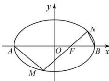

## 知识导学

非对称型韦达题型: 目标式不可以直接运用韦达定理表达

例如:非对称型 $\frac{k_{1}}{k_{2}}=\frac{x_{1}(y_{2}-2)}{x_{2}(y_{1}+2)}$ 反例:对称型 $\frac{y_{1}}{x_{1}-2}\cdot\frac{y_{2}}{x_{2}-2}$

非对称型韦达定理题型可以理解为不可以直接利用韦达定理代入, 或者理解为两根 $x_{1}, x_{2}$ 不是轮换对称的, 一定要进行处理才可以化简, 此种题型大部分是证明定值, 定点, 定线问题.

## 解题策略

(1) 和积转换——找出韦达定理中的两根之和与两根之积的关系（积转和）

(2) 配凑半代换——对能代换的部分进行韦达代换, 剩下的部分进行消元

【例题1】已知点 $F$ 为椭圆 $E: \frac{x^2}{4} + \frac{y^2}{3} = 1$ 的右焦点， $A, B$ 分别为其左、右顶点，过 $F$ 作直线 $l$ 与椭圆交于 $M$ ， $N$ 两点（不与 $A, B$ 重合），记直线 $AM, BN$ 的斜率分别为 $k_1, k_2$ ，证明 $\frac{k_1}{k_2}$ 为定值.

【分析】不妨设 $M(x_{1},y_{1}),N(x_{2},y_{2})$ ，因此 $k_{1} = \frac{y_{1}}{x_{1} + 2},k_{2} = \frac{y_{2}}{x_{2} - 2}$ 从而目标信息 $\frac{k_1}{k_2} = \frac{y_1(x_2 - 2)}{y_1(x_1 + 2)}$ ，要证明其值为定值．从目标信息的形式来看，反设直线要方便些，因此设 $l:x = ty + 1$ ，通过直线替换后可得 $\frac{k_1}{k_2} = \frac{y_1(x_2 - 2)}{y_2(x_1 + 2)} = \frac{y_1(ty_2 - 1)}{y_2(ty_1 + 3)} = \frac{ty_1y_2 - y_1}{ty_1y_2 + 3y_2}$ 出现了韦达定理结构之外的形式，即落单的 $y_{1}$ 和 $3y_{2}$ ，像此类结构，一般被称为“非对称韦达”，下面我们介绍2种常见的处理策略，

【解答】策略一：和积转换——找出韦达定理中的两根之和与两根之积的关系

联立 $\left\{ \begin{array}{l} \frac{x^2}{4} + \frac{y^2}{3} = 1 \\ x = ty + 1 \end{array} \right.$ 得 $(4 + 3t^2)y^2 + 6ty - 9 = 0$ ，则有 $y_1 + y_2 = -\frac{6t}{4 + 3t^2}, y_1y_2 = -\frac{9}{4 + 3t^2}$

由韦达定理可得， $ty_{1}y_{2} = \frac{3}{2}\left(y_{1} + y_{2}\right)$ （找出韦达定理中的两根之和与两根之积的关系）

若看不出两根之和与两根之积的关系怎么办呢？我们不妨用待定一下系数，

$$
y _ {1} y _ {2} = \lambda \left(y _ {1} + y _ {2}\right) + \mu \Rightarrow - \frac {9}{4 + 3 t ^ {2}} = \lambda \left(- \frac {6 t}{4 + 3 t ^ {2}}\right) + \mu \Rightarrow \left\{ \begin{array}{l} \lambda = \frac {3}{2 t}, \therefore t y _ {1} y _ {2} = \frac {3}{2} \left(y _ {1} + y _ {2}\right) \\ \mu = 0 \end{array} \right.
$$

$\frac{k_1}{k_2} = \frac{y_1(x_2 - 2)}{y_2(x_1 + 2)} = \frac{y_1(ty_2 - 1)}{y_2(ty_1 + 3)} = \frac{ty_1y_2 - y_1}{ty_1y_2 + 3y_2} = \frac{\frac{3}{2}(y_1 + y_2) - y_1}{\frac{3}{2}(y_1 + y_2) + 3y_2}$ ，即可得 $\frac{k_1}{k_2} = \frac{\frac{1}{2}y_1 + \frac{3}{2}y_2}{\frac{3}{2}y_1 + \frac{9}{2}y_2} = \frac{1}{3}$ 为定值，得证.

策略二：配凑半代换——对能代换的部分进行韦达代换，剩下的部分进行配凑

联立 $\left\{ \begin{array}{l} \frac{x^2}{4} + \frac{y^2}{3} = 1 \\ x = ty + 1 \end{array} \right.$ 得 $(4 + 3t^2)y^2 + 6ty - 9 = 0$ ，则有 $y_1 + y_2 = -\frac{6t}{4 + 3t^2}, y_1y_2 = -\frac{9}{4 + 3t^2}$

$$
\frac {k _ {1}}{k _ {2}} = \frac {y _ {1} (x _ {2} - 2)}{y _ {2} (x _ {1} + 2)} = \frac {y _ {1} (t y _ {2} - 1)}{y _ {2} (t y _ {1} + 3)} = \frac {t y _ {1} y _ {2} - y _ {1}}{t y _ {1} y _ {2} + 3 y _ {2}}
$$

半代换也有一定技巧, 就是配凑. 若只代换 $y_1y_2$ , 得 $\frac{k_1}{k_2} = \frac{-\frac{9t}{4 + 3t^2} - y_1}{-\frac{9t}{4 + 3t^2} + 3y_2}$ , 依然无法得到定值, 因为落单的 $y_1$ 和 $3y_2$ 不一致, 而此时为分式结构, 分式结构的定值需要满足上下一致, 且对应成比例, 抓住这个核心, 可以对 $y_1$ 和 $3y_2$ 其中某个进行配凑使其能构成比例形式. 以分子为例, 分子要出现 $y_2$ 形式, 可将分子整理为 $\frac{k_1}{k_2} = \frac{ty_1y_2 - (y_1 + y_2) + y_2}{ty_1y_2 + 3y_2}$ , 从结构上可以猜测定值为 $\frac{1}{3}$ , 不妨将韦达代入, 得 $\frac{k_1}{k_2} = \frac{-\frac{9t}{4 + 3t^2} + \frac{6t}{4 + 3t^2} + y_2}{-\frac{9t}{4 + 3t^2} + 3y_2} = \frac{-\frac{3t}{4 + 3t^2} + y_2}{-\frac{9t}{4 + 3t^2} + 3y_2} = \frac{1}{3}$ , 得证. 分母可作类似处理, 得 $\frac{k_1}{k_2} = \frac{ty_1y_2 - y_1}{ty_1y_2 + 3y_2} = \frac{-\frac{9}{4 + 3t^2} - y_1}{-\frac{27t}{4 + 3t^2} - 3y_1} = \frac{1}{3}$ .
