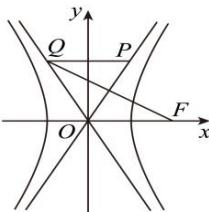

<!-- question-source:start -->
【85】如图, 已知双曲线 $C: \frac{x^{2}}{a^{2}} - \frac{y^{2}}{b^{2}} = 1 (a > 0, b > 0)$ 的右焦点为 F, 点 P, Q 分别在 C 的两条渐近线上, 且 P 在第一象限, O 为坐标原点, 若 $\overrightarrow{OF} = \overrightarrow{QP}$ , $\overrightarrow{QF} \perp \overrightarrow{OP}$ , 则双曲线 C 的离心率为（）

A. 3 B. $\sqrt{3}$ C. $\sqrt{2}$ D. 2
<!-- question-source:end -->

![[Q00008454A1]]
